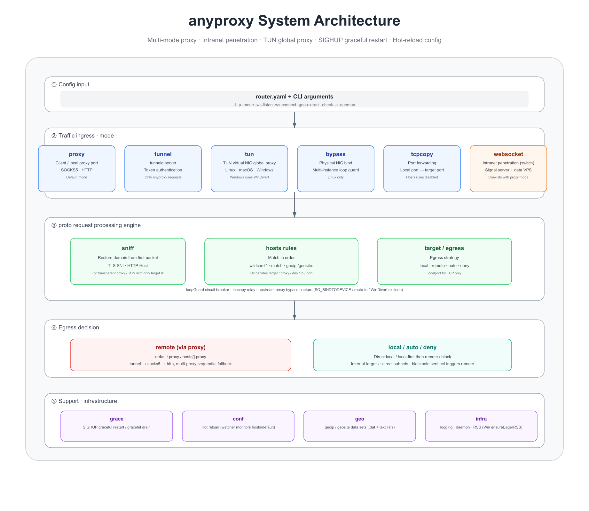
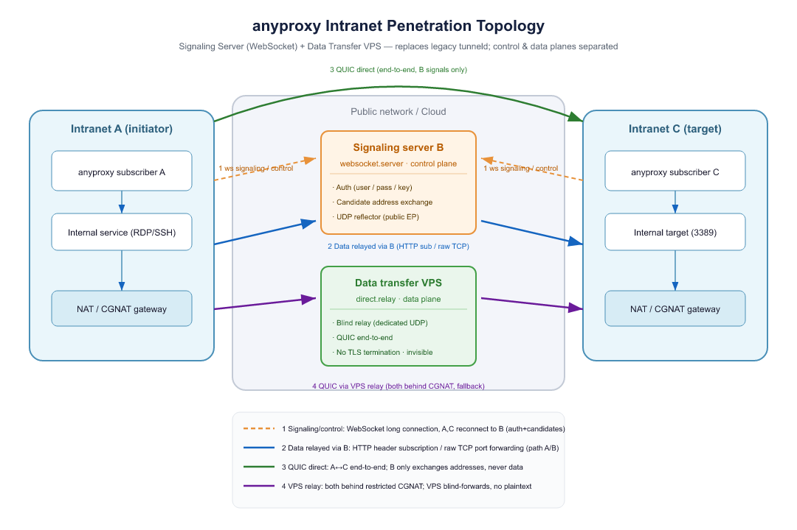

# Any Proxy

> 🌐 English · [中文](README_CN.md)

anyproxy is a cross-platform (Linux / macOS / Windows) **intelligent traffic forwarding and proxy engine**: it makes an egress decision for every connection at the granularity of domain name / GeoIP — direct locally, or forward through a multi-level upstream proxy (tunneld / socks5 / http) chain, with a single rule set governing "who goes direct, who goes through a proxy, who is denied".

It is also a unified client and server:

- **As a client**: same-port auto-detection of HTTP / SOCKS5 proxy, supports Linux iptables transparent proxy and full-platform TUN virtual network interface global capture (Windows uses WinDivert), and sniffs TLS SNI / HTTP Host from the first packet to recover the domain name, so domain-based routing also works under transparent mode;
- **As a server (tunneld / `-mode tunnel`)**: with token authentication, accepts requests from other anyproxy instances and egresses to the Internet, for cross-intranet access;
- **websocket intranet penetration**: an independent control-plane / data-plane capability — a signaling server (`websocket.server`, auth & candidate exchange) plus a data-transfer relay (a public VPS with `direct.relay` on) that brings public traffic into the intranet over end-to-end encrypted QUIC (expose intranet services / cross-intranet access), and coexists in the same process as any run mode.

[Download binary package](http://cloudme.io/anyproxy/)

> 📖 Full documentation: see [docs/README.md](docs/en/README.md): [Overview and architecture](docs/en/overview.md), [Run modes](docs/en/modes.md), [Configuration reference](docs/en/configuration.md), [Routing rules](docs/en/routing.md), [Deployment and operations](docs/en/deployment.md), [websocket intranet penetration](docs/en/websocket.md), [TUN features](docs/en/tun-features.md), [Same-host multi-instance loop](docs/en/multi-instance-loop.md).

## Core features

- **Domain-based routing**: different domains use different egress (local direct / upstream proxy / deny), matched in order via `hosts` rules, supports wildcard, CIDR, `geoip:`/`geosite:`.
- **Multi-level forwarding**: anyproxy → tunneld → socks5 → Internet, any chaining; upstream proxies support comma-separated multiple + `last`/`deny` suffix fallback chain.
- **Five run modes** (`-mode` values, mutually exclusive):
  - `proxy` (default): local SOCKS5/HTTP proxy port (**same-port auto protocol detection**, first packet discriminates HTTP/SOCKS5/raw TCP)
  - `tunnel`: tunneld server, token auth accepts other anyproxy and egresses
  - `tun`: TUN virtual network interface global proxy (Linux TUN / macOS utun+pf / **Windows WinDivert**)
  - `bypass`: physical network interface bypass (Linux only), for same-host multi-instance loop protection
  - `tcpcopy`: bridge a local port to an intranet/container port, exposing an intranet TCP service to the Internet
- **websocket intranet penetration** (independent switch, not a `-mode` value): HTTP header subscription + raw TCP port forwarding two paths, coexists in the same process as any mode.
- **Transparent proxy / domain sniffing**: Linux iptables `REDIRECT` or full-platform TUN; under transparent proxy only the target IP is available, the program sniffs the first packet's TLS SNI / HTTP Host to recover the domain so the `hosts.name` rule takes effect.
- **geoip / geosite routing**: use `.dat` (protobuf) or plain-text list (CIDR / domain), zero third-party dependency; multiple files of the same category are merged by union; `-geo-extract` extracts a small file offline.
- **SIGHUP graceful restart / config hot reload**: the `grace` package takes over fd, `-watcher` watches file changes; on SIGHUP the TUN device is released first then fork, avoiding `EBUSY` in the new process.
- **Loop fallback circuit breaker (`loopGuard`)**: judged by the proportion of forwarded connections, zero overhead in normal state, self-heals without a timer.
- **Cross-platform**: Linux / macOS / Windows; cross-compilation, ARM/MIPS routers, Docker.

## System architecture overview



> Module details see [docs/overview.md](docs/en/overview.md), [docs/modes.md](docs/en/modes.md), [docs/tun-features.md](docs/en/tun-features.md).

## websocket intranet penetration



> Full configuration and pitfalls see [docs/websocket.md](docs/en/websocket.md).

## Deployment topology

```
# Direct egress
+----------+      +----------+      +----------+
| Computer | <==> | anyproxy | <==> | Internet |
+----------+      +----------+      +----------+

# Egress via tunneld server (cross-intranet access)
+----------+      +----------+      +---------+      +----------+
| Computer | <==> | anyproxy | <==> | tunneld | <==> | Internet |
+----------+      +----------+      +---------+      +----------+

# Forward to socks5
+----------+      +----------+      +---------+      +----------+
| Computer | <==> | anyproxy | <==> | socks5  | <==> | Internet |
+----------+      +----------+      +----------+      +----------+

# websocket intranet penetration (signaling server + data-transfer VPS; A and C behind NAT/CGNAT)
+-----------+     +------------------------+     +-------------------+     +-----------+
| Intranet A| ==> | Signaling server B (ws)|     | Data-transfer VPS | <== | Intranet C|
| anyproxy  |     | auth/candidate/reflect | <=> | direct.relay      |     | anyproxy  |
+-----------+     +------------------------+     +-------------------+     +-----------+
      (A and C actively connect back to B; data goes over end-to-end QUIC or via the VPS relay; B never sees plaintext)
```

## Use cases

> Case 1: Solve the problem of pulling official images with Docker

`Use iptables or enable tun mode to route this user's TCP traffic to anyproxy, then run docker pull.`

> Case 2: Solve the problem of accessing different test environments of the same domain

`Locally browse through the intranet anyproxy proxy; when hitting a test server domain, jump to the external tunneld for forwarding; the site's nginx forwards to a specific test environment based on source IP (each environment requires its own tunneld service with a different IP).`

> Case 3: Solve the HTTPS packet-capture problem

`Locally send the https request to the server; after the server decrypts the certificate, it adds a specific header and forwards to the anyproxy websocket server; locally start another anyproxy websocket client to receive and forward the http request to Charles.`

> Case 4: Expose an intranet TCP port to the Internet

`Suppose the host is on the 192 subnet and the container is on the 10 subnet; start a program on the host that listens on a local port and bridges to the container's application port, so the container's TCP service can be accessed via the host's port (the config key is tcpcopy).`

> Case 5: Expose an intranet service to a peer across NAT/CGNAT (websocket intranet penetration)

`Both ends sit behind home broadband / NAT with no public IP, yet you can still expose an intranet RDP/SSH to the other side. The architecture splits control plane from data plane: one public machine runs the signaling server B (auth / candidate exchange), while data travels over end-to-end QUIC (falling back to a VPS blind-relay only when a direct path cannot be punched).`

## Build from source

> Requirements and GOPROXY setup

Requires **Go 1.25 or newer** (per `go 1.25.0` in `go.mod`). Installing Go is straightforward and not covered here; it is recommended to set a proxy to speed up module downloads (Go 1.13+ supports `direct` fallback):

```
go env -w GOPROXY=https://goproxy.cn,direct
```

> Download and build

```
git clone https://github.com/keminar/anyproxy.git
cd anyproxy
make all
```

## Quick start

On a new machine without a config file and unsure of the format, first generate an annotated template (trimmed by `-mode`; existing files are not overwritten):

```bash
./anyproxy -genconf                 # Generate to program dir conf/router.yaml, and create the log directory
./anyproxy -genconf -mode tunnel    # Generate by mode; -c specifies path, -c - prints to screen only
./anyproxy -c conf/router.yaml      # Run with the generated config (default also reads conf/router.yaml)
```

> Common command examples for local startup, graceful restart, Docker, etc. see [docs/quickstart.md](docs/en/quickstart.md); all startup parameters see [docs/cli.md](docs/en/cli.md); source build see above.

## Proxy settings

Client proxy settings: point your OS / browser proxy at the anyproxy listen port (default `:3000`; the same port serves both SOCKS5 and HTTP, pick whichever the client supports).

- System-wide global proxy: Linux — [docs/deployment.md](docs/en/deployment.md#linux-iptables-global-proxy) (iptables dedicated user + owner rules); all platforms TUN — [docs/tun-features.md](docs/en/tun-features.md).
- Quick check: `curl -x socks5://127.0.0.1:3000 https://ifconfig.me` and see whether the egress IP changed.

## Documentation navigation

- [docs/quickstart.md](docs/en/quickstart.md) — Quick start: local startup, tunneld, graceful restart, Docker
- [docs/overview.md](docs/en/overview.md) — Overview and architecture, what it does, data chain, process model
- [docs/modes.md](docs/en/modes.md) — Run modes (proxy / tunnel / tun / bypass / tcpcopy) + websocket penetration
- [docs/configuration.md](docs/en/configuration.md) — `router.yaml` full configuration reference
- [docs/websocket.md](docs/en/websocket.md) — websocket intranet penetration details
- [docs/routing.md](docs/en/routing.md) — Routing and proxy rules (hosts, geoip/geosite, multi-proxy fallback)
- [docs/tun-features.md](docs/en/tun-features.md) — TUN global proxy features (cross-platform, autoRoute, QUIC)
- [docs/multi-instance-loop.md](docs/en/multi-instance-loop.md) — Same-host multi-instance loop protection (bypass root fix + loopGuard fallback)
- [docs/geo.md](docs/en/geo.md) — geoip/geosite routing
- [docs/deployment.md](docs/en/deployment.md) — Deployment, iptables, Docker, tuning

Full table of contents see [docs/README.md](docs/en/README.md).

## License

[MIT](LICENSE) © [keminar](https://github.com/keminar)

## Acknowledgements

<https://github.com/ryanchapman/go-any-proxy.git>

<https://zhuanlan.zhihu.com/p/25510419>

<http://blog.fatedier.com/2018/11/21/service-mesh-traffic-hijack/>

<https://my.oschina.net/mingyuejingque/blog/754089>

<https://github.com/darkk/redsocks>

<https://www.flysnow.org/2016/12/26/golang-socket5-proxy.html>
