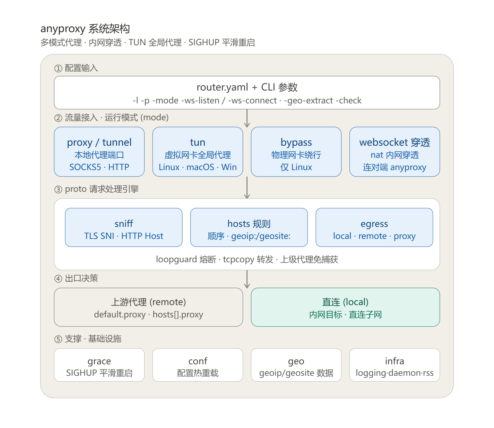
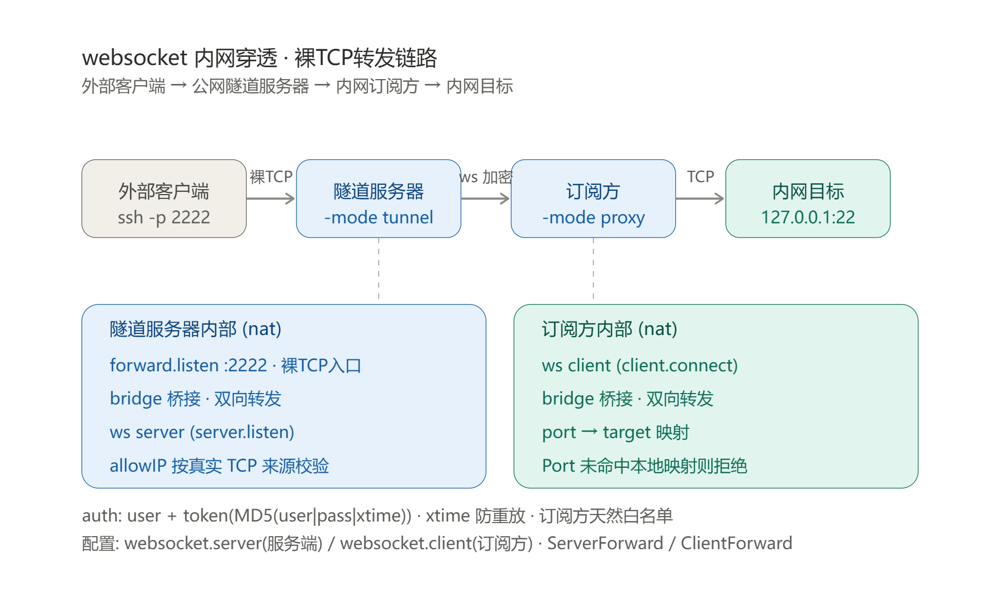

# Any Proxy

anyproxy 是一个跨平台（Linux / macOS / Windows）的**智能流量转发与代理引擎**：以域名 / GeoIP 为粒度对每条连接做出出口决策——本地直连，或经多级上游代理（tunneld / socks5 / http）链路转发，用一套规则统一治理「谁走直连、谁走代理、谁被拒绝」。

它同时是**客户端**与**服务端**的统一体：

- **作为客户端**：同端口自动识别 HTTP / SOCKS5 代理，支持 Linux iptables 透明代理与全平台 TUN 虚拟网卡全局接管（Windows 用 WinDivert），并从首包嗅探 TLS SNI / HTTP Host 还原域名，让域名级分流在透明模式下同样生效；
- **作为服务端（tunneld）**：带 token 鉴权接收其它 anyproxy 的请求代发出网，并支持 websocket 内网穿透，把公网流量安全引入内网资源（跨内网访问 / 暴露内网服务）。

[下载二进制包](http://cloudme.io/anyproxy/)

> 📖 完整文档见 [docs/README.md](docs/README.md)：[概述与架构](docs/overview.md)、[运行模式](docs/modes.md)、[配置参考](docs/configuration.md)、[路由规则](docs/routing.md)、[部署运维](docs/deployment.md)、[websocket 内网穿透](docs/websocket.md)、[TUN 特性](docs/tun-features.md)、[同机多实例死循环](docs/multi-instance-loop.md)。

## 核心特性

- **按域名分流**：不同域名走不同出口（本地直连 / 上级代理 / 拒绝），用 `hosts` 规则顺序匹配，支持通配符、CIDR、`geoip:`/`geosite:`。
- **多级转发**：anyproxy → tunneld → socks5 → Internet 任意串联；上游代理支持多代理逗号分隔 + `last`/`deny` 后缀回退链。
- **四种流量接入模式**：
  - `proxy`：本地 SOCKS5/HTTP 代理端口（**同端口自动识别协议**，首包判别 HTTP/SOCKS5/原始 TCP）
  - `tunnel`：tunneld 服务端，token 验证接收其它 anyproxy
  - `tun`：TUN 虚拟网卡全局代理（Linux TUN / macOS utun+pf / **Windows WinDivert**）
  - `bypass`：物理网卡绕行（仅 Linux），用于同机多实例死循环防护
- **websocket 内网穿透**（`nat` 模块）：HTTP 头订阅 + 裸 TCP 端口转发两条路径，独立于 `mode`，可与任一模式同进程共存。
- **透明代理 / 域名嗅探**：Linux iptables `REDIRECT` 或全平台 TUN；透明代理下只拿得到目标 IP，程序从首包嗅探 TLS SNI / HTTP Host 还原域名让 `hosts.name` 规则生效。
- **geoip / geosite 分流**：用 `.dat`（protobuf）或文本列表（CIDR / 域名），零第三方依赖；同类别多文件合并取并集；`-geo-extract` 离线提取小文件。
- **SIGHUP 平滑重启 / 配置热加载**：`grace` 包接管 fd、`-watcher` 监听文件变更；SIGHUP 时先释放 TUN 设备再 fork，避免新进程 EBUSY。
- **死循环兜底熔断器（`loopGuard`）**：在传连接占比判定，常态零开销，自愈无需计时器。
- **跨平台**：Linux / macOS / Windows；交叉编译、ARM/MIPS 路由器、Docker。

## 系统架构总览



> 模块细节见 [docs/overview.md](docs/overview.md)、[docs/modes.md](docs/modes.md)、[docs/tun-features.md](docs/tun-features.md)。

## websocket 内网穿透



> 完整配置与坑见 [docs/websocket.md](docs/websocket.md)。

## 部署拓扑

```
# 直连出网
+----------+      +----------+      +----------+
| Computer | <==> | anyproxy | <==> | Internet |
+----------+      +----------+      +----------+

# 经服务端 tunneld 出网（跨内网访问）
+----------+      +----------+      +---------+      +----------+
| Computer | <==> | anyproxy | <==> | tunneld | <==> | Internet |
+----------+      +----------+      +---------+      +----------+

# 转发到 socks5
+----------+      +----------+      +---------+      +----------+
| Computer | <==> | anyproxy | <==> | socks5  | <==> | Internet |
+----------+      +----------+      +----------+      +----------+

# 多级串联
+----------+   +----------+   +---------+   +---------+   +----------+
| Computer |=> | anyproxy |=> | tunneld |=> | socks5  |=> | Internet |
+----------+   +----------+   +---------+   +---------+   +----------+

# websocket 内网穿透
+----------+   +---------+   +-----------+  ws  +-----------+   +---------+
| Computer |=> | Nginx A |=> | anyproxy S|  ==> | anyproxy C|=> | Nginx B |
+----------+   +---------+   +-----------+      +-----------+   +---------+
```

## 使用案例

> 案例 1：解决 Docker pull 官方镜像的问题

`使用 iptables 或开启 tun 模式将本用户下 tcp 流转到 anyproxy，再进行 docker pull 操作`

> 案例 2：解决相同域名访问网站不同测试环境的问题

`本地通过内网 anyproxy 代理上网，遇到测试服务器域名则跳到外网 tunneld 转发，网站的 nginx 根据来源 IP 进行转发到特定测试环境（有几个环境就需要有几个 tunneld 服务且 IP 要不同）`

> 案例 3：解决 HTTPS 抓包问题

`本地将 https 请求到服务器，服务器解证书后增加特定头部转到 anyproxy websocket 服务端，本地另起一个 anyproxy 的 websocket 客户端接收并将 http 请求转发到 Charles`

> 案例 4：解决内网 tcp 端口给外网访问

`假如本机是 192 网段，容器内是 10 网段，在本机启动一个程序监听本机端口同时桥接到容器内的应用的端口，这样就可以通过本机端口访问容器内的 tcp 服务（配置项是 tcpcopy）`

## 源码编译

> 安装 Go 环境并设置 GOPROXY

Go 环境安装比较简单，这里不做介绍，GOPROXY 对不同版本有些差异，设置方法如下

```
# Go 版本 >= 1.11
export GOPROXY=https://goproxy.cn
# Go 版本 >= 1.13
go env -w GOPROXY=https://goproxy.cn,direct
```

> 下载编译

```
git clone https://github.com/keminar/anyproxy.git
cd anyproxy
make all
```

## 快速开始

> 本机启动、平滑重启、Docker 等常用命令示例见 [docs/quickstart.md](docs/quickstart.md)；源码编译见上文。

## TUN 虚拟网卡全局代理

除了 Linux 下用 iptables 转发外，anyproxy 还支持跨平台（Windows/Linux/macOS）全局代理。Linux/macOS 创建一块 TUN 虚拟网卡，把系统流量路由进来，内部用 gVisor 用户态协议栈解析出 TCP 连接，再复用 anyproxy 已有的代理路由（direct/tunnel/socks5/hosts 规则）转发出去，等价于 tun2socks。Windows 不建虚拟网卡，改用 WinDivert 在网络层捕获并重定向出站 TCP，再复用同一套代理逻辑。

> 特性与规则详解（跨平台 utun、autoRoute、QUIC 拦截、target/proxy 优先级）见 [docs/tun-features.md](docs/tun-features.md)

> 说明

- 复用配置文件里 `default` / `hosts` 的全部代理规则（direct/tunnel/socks5/换 IP/换端口等），用法和旧的透明代理一致
- 支持按域名配置不同代理：TUN 只拿得到目标 IP，程序会从首包嗅探 TLS SNI / HTTP Host 还原域名，让 `hosts.name` 的域名规则生效；嗅探不到（如服务端先说话的协议）则回退按 IP 匹配
- 目前只代理 TCP 流量，UDP（含 DNS）暂不走隧道。全量接管路由时要给 DNS 服务器加直连例外，否则无法解析域名（或改用 DoH/DoT 这类走 TCP 的 DNS）
- 需要管理员/root 权限运行
- Windows 用 WinDivert：把 `WinDivert.dll` + `WinDivert64.sys`（32 位系统另需 `WinDivert32.sys`）与 `anyproxy.exe` 放同一目录（路径含空格/中文可能导致驱动加载失败）。详见 [docs/windows-winDivert.md](docs/windows-winDivert.md)
- Linux/macOS 程序负责创建网卡、分配接口 IP 并启用；路由采用半自动方式，启动时会打印所需路由命令供确认后执行

> 启动与全局路由配置（含 `autoRoute: false` 手动接管命令）见 [docs/tun-features.md](docs/tun-features.md#1-跨平台-tun-支持)。

## 同机多实例的死循环防护

同机部署两套 anyproxy：A 开 `mode=tun` 做全局代理并把请求转给上游 B，B 普通模式作为出口。A 的 TUN 会把 `0.0.0.0/1`、`128.0.0.0/1` 全量流量吸进来；A 自己的出向已用 `SO_BINDTODEVICE` 绑物理网卡逃出 TUN，但 **B 的出向没逃**，会被 A 的 TUN 再次抓走 → A → B → …… 形成死循环。

> 防环方案：B 用 `mode=bypass`（仅 Linux）绑物理网卡从路由层根治，`loopGuard` 熔断器兜底；各平台替代方案、配置与调优见 [docs/multi-instance-loop.md](docs/multi-instance-loop.md)。

## 代理设置

> Linux 下 iptables 防火墙全局代理（专用用户 + owner 规则）、规则查看与删除，以及浏览器 / 手机端代理设置，见 [docs/deployment.md](docs/deployment.md#linux-iptables-全局代理)。

## 文档导航

- [docs/quickstart.md](docs/quickstart.md) — 快速开始：本机启动、tunneld、平滑重启、Docker
- [docs/overview.md](docs/overview.md) — 概述与架构、能做什么、数据链路、进程模型
- [docs/modes.md](docs/modes.md) — 运行模式（proxy / tunnel / tun / bypass / tcpcopy） + websocket 穿透
- [docs/configuration.md](docs/configuration.md) — `router.yaml` 完整配置参考
- [docs/websocket.md](docs/websocket.md) — websocket 内网穿透详解
- [docs/routing.md](docs/routing.md) — 路由与代理规则（hosts、geoip/geosite、多代理 fallback）
- [docs/tun-features.md](docs/tun-features.md) — TUN 全局代理特性（跨平台、autoRoute、QUIC）
- [docs/multi-instance-loop.md](docs/multi-instance-loop.md) — 同机多实例死循环防护（bypass 根治 + loopGuard 兜底）
- [docs/geo.md](docs/geo.md) — geoip/geosite 分流
- [docs/deployment.md](docs/deployment.md) — 部署、iptables、Docker、调优

完整目录见 [docs/README.md](docs/README.md)。

## 感谢

<https://github.com/ryanchapman/go-any-proxy.git>

<https://zhuanlan.zhihu.com/p/25510419>

<http://blog.fatedier.com/2018/11/21/service-mesh-traffic-hijack/>

<https://my.oschina.net/mingyuejingque/blog/754089>

<https://github.com/darkk/redsocks>

<https://www.flysnow.org/2016/12/26/golang-socket5-proxy.html>
