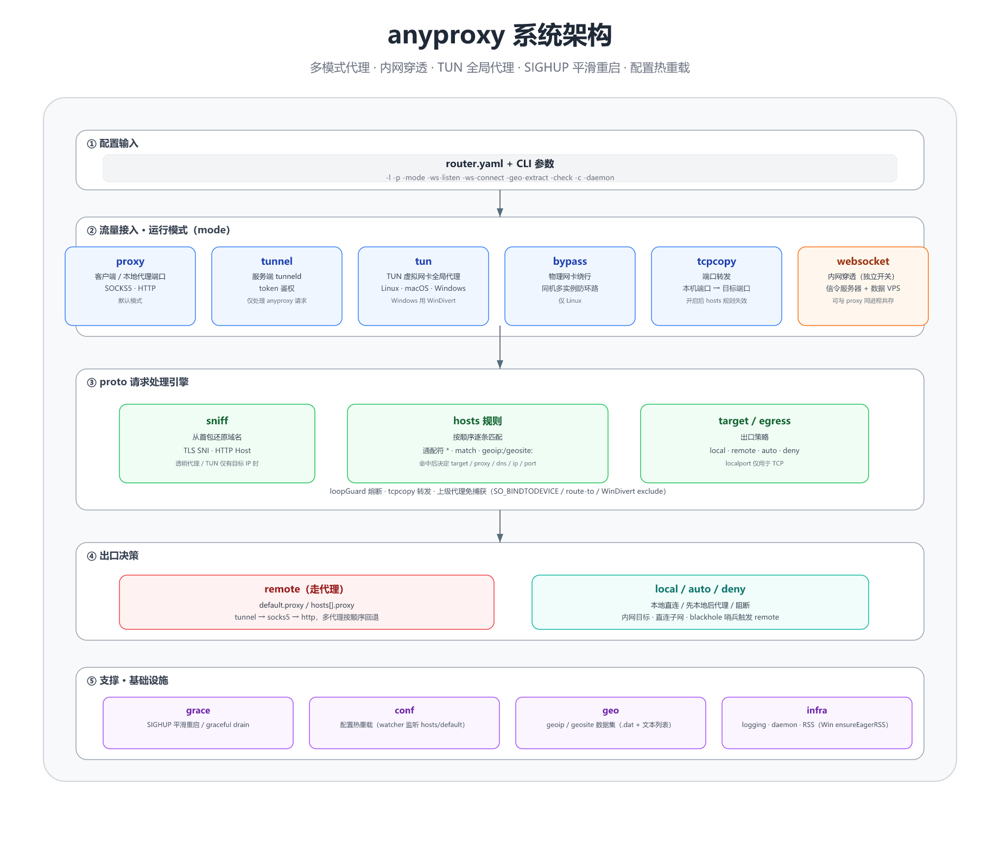
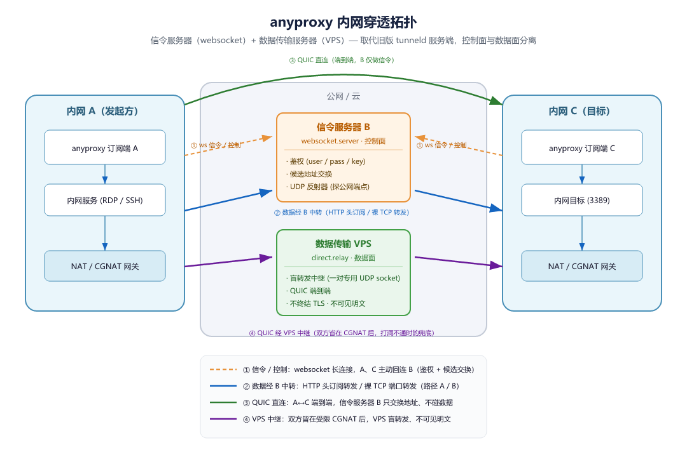

# Any Proxy

anyproxy 是一个跨平台（Linux / macOS / Windows）的**智能流量转发与代理引擎**：以域名 / GeoIP 为粒度对每条连接做出出口决策——本地直连，或经多级上游代理（tunneld / socks5 / http）链路转发，用一套规则统一治理「谁走直连、谁走代理、谁被拒绝」。

它同时是**客户端**与**服务端**的统一体：

- **作为客户端**：同端口自动识别 HTTP / SOCKS5 代理，支持 Linux iptables 透明代理与全平台 TUN 虚拟网卡全局接管（Windows 用 WinDivert），并从首包嗅探 TLS SNI / HTTP Host 还原域名，让域名级分流在透明模式下同样生效；
- **作为服务端（tunneld / `-mode tunnel`）**：带 token 鉴权接收其它 anyproxy 的请求并代发出网，用于跨内网访问；
- **websocket 内网穿透**：独立的控制面 / 数据面能力——信令服务器（`websocket.server`，鉴权与候选交换）+ 数据传输中继（公网 VPS 开 `direct.relay`），把公网流量经 QUIC 端到端加密安全引入内网（暴露内网服务 / 跨内网访问），可与任一运行模式同进程共存。

[下载二进制包](http://cloudme.io/anyproxy/)

> 📖 完整文档见 [docs/README.md](docs/README.md)：[概述与架构](docs/overview.md)、[运行模式](docs/modes.md)、[配置参考](docs/configuration.md)、[路由规则](docs/routing.md)、[部署运维](docs/deployment.md)、[websocket 内网穿透](docs/websocket.md)、[TUN 特性](docs/tun-features.md)、[同机多实例死循环](docs/multi-instance-loop.md)。

## 核心特性

- **按域名分流**：不同域名走不同出口（本地直连 / 上级代理 / 拒绝），用 `hosts` 规则顺序匹配，支持通配符、CIDR、`geoip:`/`geosite:`。
- **多级转发**：anyproxy → tunneld → socks5 → Internet 任意串联；上游代理支持多代理逗号分隔 + `last`/`deny` 后缀回退链。
- **五种运行模式**（`-mode` 取值，互斥）：
  - `proxy`（默认）：本地 SOCKS5/HTTP 代理端口（**同端口自动识别协议**，首包判别 HTTP/SOCKS5/原始 TCP）
  - `tunnel`：tunneld 服务端，token 验证接收其它 anyproxy 并代发出网
  - `tun`：TUN 虚拟网卡全局代理（Linux TUN / macOS utun+pf / **Windows WinDivert**）
  - `bypass`：物理网卡绕行（仅 Linux），用于同机多实例死循环防护
  - `tcpcopy`：把本地端口桥接到内网/容器端口，把内网 TCP 服务暴露给外网
- **websocket 内网穿透**（独立开关，非 `-mode` 取值）：HTTP 头订阅 + 裸 TCP 端口转发两条路径，与任一模式同进程共存。
- **透明代理 / 域名嗅探**：Linux iptables `REDIRECT` 或全平台 TUN；透明代理下只拿得到目标 IP，程序从首包嗅探 TLS SNI / HTTP Host 还原域名让 `hosts.name` 规则生效。
- **geoip / geosite 分流**：用 `.dat`（protobuf）或文本列表（CIDR / 域名），零第三方依赖；同类别多文件合并取并集；`-geo-extract` 离线提取小文件。
- **SIGHUP 平滑重启 / 配置热加载**：`grace` 包接管 fd、`-watcher` 监听文件变更；SIGHUP 时先释放 TUN 设备再 fork，避免新进程 EBUSY。
- **死循环兜底熔断器（`loopGuard`）**：在传连接占比判定，常态零开销，自愈无需计时器。
- **跨平台**：Linux / macOS / Windows；交叉编译、ARM/MIPS 路由器、Docker。

## 系统架构总览



> 模块细节见 [docs/overview.md](docs/overview.md)、[docs/modes.md](docs/modes.md)、[docs/tun-features.md](docs/tun-features.md)。

## websocket 内网穿透



> 完整配置与坑见 [docs/websocket.md](docs/websocket.md)。

## 部署拓扑

```
# 直连出网
+----------+      +----------+      +----------+
| Computer | <==> | anyproxy | <==> | Internet |
+----------+      +----------+      +----------+

# 经服务端 tunneld 出网（跨内网访问）
+----------+      +----------+      +---------+      +----------+
| Computer | <==> | anyproxy | <==> | tunneld | <==> | Internet |
+----------+      +----------+      +---------+      +----------+

# 转发到 socks5
+----------+      +----------+      +---------+      +----------+
| Computer | <==> | anyproxy | <==> | socks5  | <==> | Internet |
+----------+      +----------+      +----------+      +----------+

# websocket 内网穿透（信令服务器 + 数据传输 VPS，A/C 均在 NAT/CGNAT 后）
+-----------+     +------------------------+     +-------------------+     +-----------+
| 内网 A    | ==> | 信令服务器 B (ws)        |     | 数据传输 VPS 中继   | <== | 内网 C    |
| anyproxy  |     | 鉴权/候选交换/反射器     | <=> | direct.relay      |     | anyproxy  |
+-----------+     +------------------------+     +-------------------+     +-----------+
            (A、C 主动回连 B；数据走 QUIC 端到端或经 VPS 中继，B 不碰明文)
```

## 使用案例

> 案例 1：解决 Docker pull 官方镜像的问题

`使用 iptables 或开启 tun 模式将本用户下 tcp 流转到 anyproxy，再进行 docker pull 操作`

> 案例 2：解决相同域名访问网站不同测试环境的问题

`本地通过内网 anyproxy 代理上网，遇到测试服务器域名则跳到外网 tunneld 转发，网站的 nginx 根据来源 IP 进行转发到特定测试环境（有几个环境就需要有几个 tunneld 服务且 IP 要不同）`

> 案例 3：解决 HTTPS 抓包问题

`本地将 https 请求到服务器，服务器解证书后增加特定头部转到 anyproxy websocket 服务端，本地另起一个 anyproxy 的 websocket 客户端接收并将 http 请求转发到 Charles`

> 案例 4：解决内网 tcp 端口给外网访问

`假如本机是 192 网段，容器内是 10 网段，在本机启动一个程序监听本机端口同时桥接到容器内的应用的端口，这样就可以通过本机端口访问容器内的 tcp 服务（配置项是 tcpcopy）`

> 案例 5：跨 NAT/CGNAT 把内网服务暴露给对端（websocket 内网穿透）

`两端都在家庭宽带/NAT 后、没有公网 IP，也能把内网 RDP/SSH 暴露给另一端。架构是控制面 + 数据面分离：一台公网机器跑信令服务器 B（鉴权/候选交换），数据走端到端 QUIC（打不通时再经 VPS 盲转发中继）。`

## 源码编译

> 环境要求与 GOPROXY 设置

需要 **Go 1.25 及以上**（由 `go.mod` 中的 `go 1.25.0` 决定）。Go 环境安装比较简单，这里不做介绍；建议配置代理以加速模块下载（Go 1.13+ 已支持 `direct` 回退）：

```
go env -w GOPROXY=https://goproxy.cn,direct
```

> 下载编译

```
git clone https://github.com/keminar/anyproxy.git
cd anyproxy
make all
```

## 快速开始

新机器上没有配置文件、不知道格式时，先生成一份带注释的模板（按 `-mode` 裁剪，已存在的文件不覆盖）：

```bash
./anyproxy -genconf                 # 生成到程序目录 conf/router.yaml，顺带建出日志目录
./anyproxy -genconf -mode tunnel    # 按模式生成；-c 指定路径，-c - 只打到屏幕
./anyproxy -c conf/router.yaml      # 生成后直接运行（默认也读 conf/router.yaml）
```

> 本机启动、平滑重启、Docker 等常用命令示例见 [docs/quickstart.md](docs/quickstart.md)；全部启动参数见 [docs/cli.md](docs/cli.md)；源码编译见上文。

## 代理设置

客户端代理设置：把操作系统 / 浏览器的代理指向 anyproxy 监听端口（默认 `:3000`，同一端口同时支持 SOCKS5 与 HTTP，客户端按需选一种即可）。

- 系统级全局代理：Linux 见 [docs/deployment.md](docs/deployment.md#linux-iptables-全局代理)（iptables 专用用户 + owner 规则）；全平台 TUN 见 [docs/tun-features.md](docs/tun-features.md)。
- 临时验证：浏览器装个 SwitchyOmega 之类的插件切到 anyproxy 端口，或命令行 `curl -x socks5://127.0.0.1:3000 https://ifconfig.me` 看出口 IP 是否变化。

## 文档导航

- [docs/quickstart.md](docs/quickstart.md) — 快速开始：本机启动、tunneld、平滑重启、Docker
- [docs/overview.md](docs/overview.md) — 概述与架构、能做什么、数据链路、进程模型
- [docs/modes.md](docs/modes.md) — 运行模式（proxy / tunnel / tun / bypass / tcpcopy） + websocket 穿透
- [docs/configuration.md](docs/configuration.md) — `router.yaml` 完整配置参考
- [docs/websocket.md](docs/websocket.md) — websocket 内网穿透详解
- [docs/routing.md](docs/routing.md) — 路由与代理规则（hosts、geoip/geosite、多代理 fallback）
- [docs/tun-features.md](docs/tun-features.md) — TUN 全局代理特性（跨平台、autoRoute、QUIC）
- [docs/multi-instance-loop.md](docs/multi-instance-loop.md) — 同机多实例死循环防护（bypass 根治 + loopGuard 兜底）
- [docs/geo.md](docs/geo.md) — geoip/geosite 分流
- [docs/deployment.md](docs/deployment.md) — 部署、iptables、Docker、调优

完整目录见 [docs/README.md](docs/README.md)。

## License

[MIT](LICENSE) © [keminar](https://github.com/keminar)

## 感谢

<https://github.com/ryanchapman/go-any-proxy.git>

<https://zhuanlan.zhihu.com/p/25510419>

<http://blog.fatedier.com/2018/11/21/service-mesh-traffic-hijack/>

<https://my.oschina.net/mingyuejingque/blog/754089>

<https://github.com/darkk/redsocks>

<https://www.flysnow.org/2016/12/26/golang-socket5-proxy.html>
