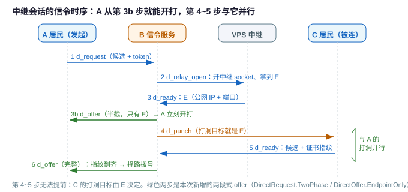
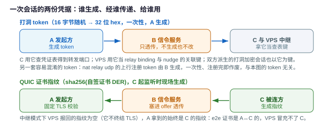
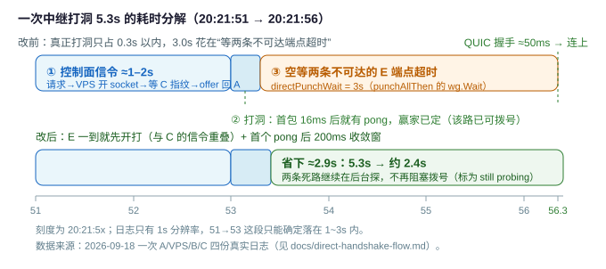
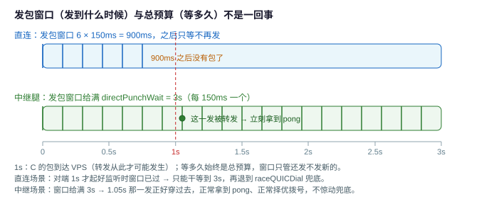

# 直连 / 中继握手的全流程与耗时

本文把一次直连(或经 VPS 盲转发中继)的握手拆开看:**谁先发、等谁、时间花在哪**。五张图都是
同一批代码的可视化, 数字来自 2026-09-18 采集的一次真实运行(A/VPS/B/C 四份日志)。

先看结论: 那次连接从第一行日志到建连共 **5.3s**, 其中真正打洞不到 0.3s, **3.0s 花在"等两条
不可达的候选各自超时"**。把这段等齐改成"首个回包 + 收敛窗"、并让 A 提前开打(两段式 offer)
之后, 同一场景约 **2.4s** 就能建连。

## 1. 参与方与消息

| 角色 | 是什么 | 在本流程里的职责 |
|---|---|---|
| A | 发起方(有入口连接进来的一方) | 生成 token、收集自己的候选、朝对端打洞、拨 QUIC |
| C | 被连方(最终目标) | 起 QUIC 监听、报候选与证书指纹、朝对端打洞 |
| B | websocket 信令服务 | 只转交控制消息; 数据面完全不经它 |
| VPS | 中继节点(`via` 非空时参与) | 开专用 UDP socket、报中继端点 E、盲转发 A↔C 的 QUIC |

消息(见 `nat/direct_msg.go`):

| 方法 | 方向 | 作用 |
|---|---|---|
| `d_request` | A → B | 报自己的候选 + 本次 token(+ `via`/`twoPhase`) |
| `d_relay_open` | B → VPS | 让 VPS 开中继 socket 并回报端点 E |
| `d_punch` | B → C / B → VPS | 让 C 朝 E 打洞; 或让 VPS 登记一条腿的候选 |
| `d_ready` | C/VPS → B | 回报候选 + 证书指纹(VPS 的指纹为空) |
| `d_offer` | B → A | 把端点交给 A; 两段式时先发"只有 E"的半截 |
| `d_punching` | A/C → B → VPS | 打洞 nudge: "我已经朝你打过包了" |

## 2. 信令时序: A 在第 3b 步就能开打

第 4~5 步(B 请 C 打洞、C 回报指纹)**不可能提前** —— C 的打洞目标就是 E, 没有 E 它就打不了。
所以能压缩的只有"A 等 E 和等指纹的这段时间": 现在 E 一到就先发给 A(第 3b 步), A 立刻朝 E
打洞 + nudge, 与第 4~5 步并行。

## 3. 顺序不变量: 居民先打, VPS 后打

两条腿(A、C)各自独立走这四步。顺序不是靠"谁更快"凑出来的: nudge 由 `punchOnlyThen` /
`punchAllThen` 的 `afterFirst` 回调发出, 而回调打在 UDP `WriteTo` 成功返回之后 —— 是代码顺序。
VPS 侧则**没有兜底定时器**(定时器一旦踩空就会在居民真正打洞前抢发, 毒化居民的 CGNAT 映射),
nudge 丢了靠居民连发 3 次(0/+600ms/+1.8s), VPS 按腿幂等。

转发数据的门槛更高: nudge 只是让 VPS *敢*发, 而**转发**另有硬条件。`forwardLoop`
(`nat/direct_relay.go`)里三道关, 任何一道没过就当场丢包(见
[direct-relay-design.md](direct-relay-design.md) §5):

1. **来源得能认出是某条腿**: `classify` 按候选 IP 命中; B 还没登记这条腿、或来源 IP 不在它的
   候选里, 丢。
2. **对侧腿已经登记**: `to == nil` 就丢。
3. **必须亲耳听到过对侧**: `to.addr == nil` 就丢 —— 这才是真正的"就绪"判据: 是**收到过 C 的包**,
   而不是"VPS 朝 C 发成功过"(VPS 有没有发过、发通没发通, 转发逻辑并不检查, 那是 `punchLeg`
   的保险作用)。

两个容易记错的细节:

- `from.addr.Swap(src)`(记下 A 的真实地址)**排在 `to == nil` 判断之后** —— 所以 C 腿登记之前,
  VPS 连 A 的地址都不记。C 一就绪, A 必须**再发一个包**, 那一发才会被转发、才换来 C 的 pong。
  这正是中继腿"发包窗口要给满"的原因(见 §5.1)。
- A 的 QUIC Initial 走的是同一条转发路径: 两腿都就绪之前, A 就算提前拨号, Initial 也会被丢掉,
  只能靠 QUIC 自己的 Initial 重传(PTO)等到就绪。反过来说, A 在**打洞阶段**拿到的 pong 只可能
  来自 C 经转发回的 pong, 所以"有 pong" 就等于"转发已就绪"(例外只有 §6.1 的全灭兜底)。

## 4. 两份凭据: token 与证书指纹

- **token 由 A 生成**(16 字节随机 → 32 位 hex), B 只透传。它同时是: C 侧凭证表(带转发端口)、
  打洞报文的加密会话键、VPS 的中继 binding 与 nudge 关联键。
- **证书指纹由 C 生成**(起监听时现场签发自签证书, 指纹 = `sha256(DER)`), 经 B 转给 A 做 TLS
  固定; 中继模式下 VPS 报回的指纹是空的, A 拿到的始终是 C 的 —— e2e 证书属于 A↔C。

## 5. 耗时: 5.3s 花在哪

| 阶段 | 改前 | 改后 | 代码 |
|---|---|---|---|
| 控制面信令(A→B→VPS→B→C→B→A) | 1~2s | 1~2s, 但不再压着打洞 | `requestPeer` / `onRelayRequest` / `onRelayReady` |
| 打洞(首个 pong) | 16ms | 16ms | `punchOneThen` |
| 等所有候选出结论 | **3.0s** | ≈0.2s | `punchAllThen` 的 `wg.Wait` → `punchRun` 首个回包 + `directPunchSettle` |
| QUIC 握手 + 鉴权 | <1s | <1s | `dialQUIC` / `authenticateSession` |
| **合计** | **≈5.3s** | **≈2.4s** | |

为什么"等齐"这么贵: 打洞是朝每个候选各发 6 个包(间隔 150ms)、总计等 `directPunchWait`(3s)
的预算; 而只要有一条候选从头不回包(中继那组 E 端点在跨网时很常见), 等齐就必须为它把这 3s
跑满 —— 哪怕第一条路十几毫秒就回了 pong。

### 5.1 三个时间量: 总预算 / 发包窗口 / 收敛窗

打洞相关的参数有三个, 名字像、作用完全不同:

| 名字 | 值 | 管什么 |
|---|---|---|
| `directPunchWait` | 3s | **总预算**: 一条候选从开探到放弃, 等 pong 的上限 |
| 发包窗口 `sendSpan`(`punchSendSpan`) | 直连 `6 × 150ms` = 900ms; 中继腿 3s | **还发不发新包**: 窗口内每 150ms 发一个, 窗口过后只等、不再发 |
| `directPunchSettle` | 200ms | **收敛窗**: 首个 pong 到了之后再留这么久收集其它候选结果, 然后择优拨号 |

三者互相独立: **发包窗口只决定"还发不发新的", 不决定"等多久"**(等多久始终是总预算);
收敛窗只在已经有第一个 pong 之后才开始计时。拿到任一个 pong 就立刻停发并提前返回 —— 所以
健康的直连实际只发 1~2 个包, 而不是 6 个。

中继腿为什么要把窗口拉到 3s: 见 §3 的最后两条(转发要等两腿都就绪, 而早打的那一侧并不知道
就绪时刻, 只能一直敲)。

## 6. 两个已落地的优化

### 6.1 选路收敛窗: 不等所有候选

- `nat/direct_reflect.go` 的 `punchRun`: 把"朝所有候选打洞"变成可观察的过程(首个回包信号 /
  全部收工信号 / 随时可取的结果快照), 每个候选有 **pending / 通了 / 失败** 三态。
- `direct_entry.go` 的 `pickPeerAddr`: 首个 pong 之后再留 `directPunchSettle`(200ms)的收敛窗,
  然后在"已有结论"的候选里择优就拨号。**没等到结论的候选标成 `still probing`**, 既不会以
  RTT 零值假装赢家, 也不会被误读成"不可达"; 它们的探测在后台跑完(超时自行退出, 不泄漏)。
- 全灭语义不变: 预算内一条都没通, 仍然回错并转入 `raceQUICDial` 的并行拨号竞速。
- **中继腿的发包窗口给满 `directPunchWait`**(`punchSendSpan`): 早打意味着很可能在 C 打出
  第一发、VPS 登记好那条腿之前就开打, 而 VPS 转发要求**两条腿都被听到** —— 这段时间里
  "没有 pong"只说明中间层还没就绪, 不是路不通, 所以必须一直敲到预算结束(直连没有这个中间层,
  仍然只发 `directPunchCount` 个)。
- 日志里能直接看出差别: `path selection for X: ... still probing, ... rtt=16ms <-`。

### 6.2 两段式 offer: E 先给 A, 指纹随后

- 协议: `DirectRequest.TwoPhase`(由 A 声明, 老服务端忽略它)与 `DirectOffer.EndpointOnly`
  (B 只在对方声明了 TwoPhase 时才发半截 offer)。**老客户端遇新服务端、新客户端遇老服务端,
  行为都退化成原来的一段式**, 不会因为缺指纹而判成 "incomplete offer"。
- B(`relayRoleOpen` 分支): 拿到 E 后先发半截 offer, 再登记 A 腿、请 C 打洞。
- A(`requestPeer` / `handshakeFromOffer`): 收到半截就 `startPunchAll` 立刻开打, 同时继续等
  带指纹的完整 offer; 指纹一到就按收敛窗择优拨号。半截 offer 只用于**打洞**, 绝不用于拨号 ——
  TLS 固定校验依赖指纹。
- 覆盖用例: `TestPunchRunStopsAtFirstAnswer`(201ms 收手而不是 3s)、`TestPunchRunPendingIsNotAWinner`、
  `TestPunchKeepsSendingUntilTheRelayIsReady`、`TestRelayTwoPhasePushesEndpointAheadOfFingerprint`、
  `TestRelayOnePhaseOfferStaysSingle`。

### 6.3 还没做的(可选)

把 `direct.relayPublic` 写成 `IP:port` 静态端点(`newStaticRelaySocket`)时 E 完全可预测, 那时
"开 socket"与"请 C 打洞"可以并行发出, 甚至可以把 E 提前下发, 让三方在信令之前就开始打洞 ——
能再省一段串行往返, 代价是要固定中继端口(一个端口一对并发)。

## 7. 怎么读日志

| 日志 | 含义 |
|---|---|
| `candidates [...] (unavailable: ...)` | 本机候选; 括号里是没成的那几路(如没有 IPv6) |
| `requesting X: local socket port ..., my candidates ...` | 发出 `d_request` |
| `server sent the endpoint [...] ahead of the peer certificate, punching while its fingerprint is still on the way` | 两段式第一段到了, 开始打洞 |
| `server says X has candidates [...] (fingerprint ...)` | 完整 offer 到了(指纹齐) |
| `got punch from ... (encrypted=...)` | 收到打洞包并回 pong; 中继里 `encrypted=false` 的多半是 VPS 自己的 `punchLeg`(它没有 e2e 会话) |
| `relay: resent nudge for token ...` | nudge 的补发(设计如此, 共 3 次), 不是"重试打洞" |
| `path selection for X: ... failed / still probing / rtt=...` | 择优详情; `failed` = 探过没回包, `still probing` = 没赶上收敛窗(不代表不可达) |
| `punch all failed (...), falling back to a quic dial race` | 全灭兜底, 对**所有**候选同时真拨 QUIC |
| `quic connected to email X at ...` | 拨号成功(还没算鉴权) |
| (VPS)`registered leg ... holding punch until its nudge` | 腿已登记, 等它的 nudge |
| (VPS)`leg ... nudged, punching toward it at ...` | 收到 nudge, 开始朝这条腿发包 |
| (VPS)`leg ... answered after N punch(es), ... stopping` | 已听到这条腿, 提前收手(N 通常是 1) |
| (VPS)**什么都不打** | 那一发被静默丢了: 来源认不出是哪条腿, 或对侧腿还没登记/还没亲耳听到。转发路径对这种丢弃**不打日志**, 要确认只能抓包(`tcpdump -ni any udp port <中继端口>`) |

> 关于"什么时候才开始转发", 以及 A 拿到 pong 为什么就等于"转发已就绪", 见 §3。

## 8. 相关代码与文档

- A 侧入口: [nat/direct_entry.go](../nat/direct_entry.go) —— `requestPeer` / `handshakeFromOffer` /
  `ensureSession` / `pickPeerAddr` / `connectPeer`
- 打洞与择优: [nat/direct_reflect.go](../nat/direct_reflect.go) —— `punchRun` / `startPunchAll` /
  `punchOneThen`; [nat/direct_candidate.go](../nat/direct_candidate.go) —— `selectCandidate` / `describeResults`
- C 侧: [nat/direct_accept.go](../nat/direct_accept.go) —— `onPunch` / `sendRelayNudge`
- VPS 侧: [nat/direct_relay.go](../nat/direct_relay.go) —— `registerRelayLeg` / `punchLeg` /
  `forwardLoop` / `openRelay`
- B 侧: [nat/direct_broker.go](../nat/direct_broker.go) —— `onRelayRequest` / `onRelayReady`(两段式)
- 参数: [nat/direct.go](../nat/direct.go) —— `directPunchWait` / `directPunchSettle` /
  `directPunchCount` / `directPunchGap` / `directRelayNudgeGaps`
- 相关文档: [direct-relay-design.md](direct-relay-design.md)(中继的设计与失败语义)、
  [direct-punch-order.md](direct-punch-order.md)(顺序不变量)
