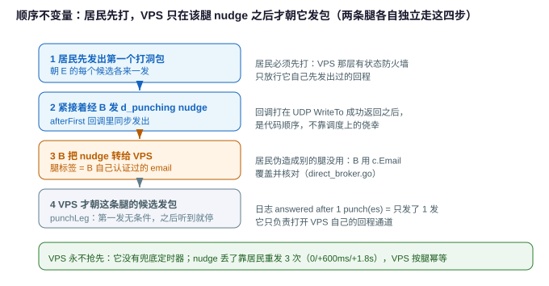

# VPS 盲转发中继(TURN 式 direct relay)

> **状态:已实现(第二期)。** 控制面(via/d_relay_open/两腿登记)、数据面(专用 socket
> 盲转发)、鉴权(e2e uuid 挑战-应答绑指纹)均已落地并有单测/全链路测试覆盖。代码落点见 §11。
> 取代了早期"VPS 两腿各终结 TLS、在中间桥接"的思路(见文末"废弃方案")。
>
> 实现与本文的一处措辞出入:C 不靠 A 在流里自报 email,而是用 **B 经打洞消息(DirectPunch.Email)
> 转来的、B 认证过的发起方 email** 去查 receive.allow(A 伪造不了身份),挑战-应答只走 nonce 与
> HMAC 应答两帧。
>
> **第二期改动(相对第一期)**:VPS 不再靠 nudge + `direct.punchFirst` **兜底定时器**去猜"该等多久
> 没等到 nudge 就该给某条腿打一发"——早期这个定时器取值偏短,一旦另一条腿的信令来回比预期慢,
> VPS 就会在那条腿真正打过洞之前抢先发包过去,直接把它的 CGNAT 映射打坏。现在**兜底定时器整个
> 删掉**:VPS 只在**收到那条腿的 nudge**(经 B 转来,带 B 认证过的腿标签)之后才朝它主动发包,
> 等不到就宁可不发。nudge 是"这条腿已经打过了"的确定信号,走已鉴权的 websocket 控制面,不靠
> 猜时间;VPS 侧的 `direct.punchFirst` 也依然不需要为中继腿设置。见 §3、§6。
>
> **为什么"VPS 自己主动发包"这一步不能省**:VPS 这台机器前面同样可能有一层有状态防火墙/安全组
> (云厂商的出口网关很常见),只放行"本机先朝某个具体地址发过包"之后的回程。它不主动朝外发这
> 一下,居民先打的洞在 VPS 眼里等于不存在 —— 居民的包一个都进不来,"听到某条腿"这件事也就
> 永远不会发生。第二期曾一度把"绝不抢先"做成"VPS 彻底不主动发包、只等先听到再回包",实测
> 翻车:原本用同一台 VPS 能通的线路改完之后彻底断了。所以主路径必须是 **nudge 驱动的主动
> 发包**(`punchLeg`),而"亲耳听到某条腿之后反过来补几发"(`primeLeg`)只是补充。

## 1. 目标

一台公网 VPS 当 A、C 之间的**配置极轻的中继**:VPS **不为每对 A-C 配 `forward`/`direct`/
`receive.allow`**,只需一个"允许中继"总开关;目标 C 由 **A 在请求里指定**。

适用场景:A、C 都在受限 CGNAT 后、彼此直连打不通(见 [direct-punch-order.md](direct-punch-order.md)),
但各自能和公网 VPS 打通。数据经 VPS 中继,**不经**信令服务器 B(B 网络差)。

一次性覆盖 **TCP + UDP**(RDP 的 TCP 主通道 + UDP 图形通道)。文件传输(`-send`/`-recv`)
**不在本设计**,那条已有 `-via relay`(经 B)可用。

## 2. 核心模型:VPS 只做盲转发,QUIC 端到端在 A↔C 之间

关键选择:**QUIC/TLS 连接是端到端 A↔C 的**(A 当 client、C 当 server 出示 C 的自签证书,
A 用指纹固定校验);**VPS 只在传输层转发不透明的 UDP 包**,不终结 TLS、不解 QUIC。

```
   A ─────(QUIC-TLS 端到端, VPS 看不见明文)───── C
   │                                             │
   │  UDP 包                              UDP 包  │
   └───────────▶  VPS 专用中转 socket  ◀──────────┘
              (按源地址在 A↔C 之间盲转发)
   数据不经 B;B 只在建立阶段交换地址/指纹/token
```

**这个模型顺带把 TCP+UDP 的难点消掉了**:VPS 转发的是 A↔C 那条 QUIC 连接的**不透明报文**,
TCP 走它的 stream、UDP 走它的 datagram,全在 A 和 C 之间那条端到端 QUIC 里处理——**和现在的
直连完全一样**。VPS 不区分协议、不做 stream/datagram 桥接、不做 sessionID 映射。所以
"TCP+UDP 一起"是天然成立的。

## 3. 控制面:信令流程

> 六步时序图、两段式 offer(把中继端点 E 先发给 A, 让 A 的打洞与 C 的信令重叠)、以及一次真实
> 连接的耗时分解, 见 [direct-handshake-flow.md](direct-handshake-flow.md)。

**A 的配置**(给 `client.direct.rules[]` 加 `via`):

```yaml
# A(居民, CGNAT)
websocket:
  client:
    direct:
      punchFirst: true                # 仅对直连(不经 via)场景的顺序有意义, 见 direct-punch-order.md;
                                       # 中继腿不看这个开关: 两腿都是居民、都先打, VPS 只在收到
                                       # 该腿 nudge 后才发, 不存在"谁先打"的歧义(见 §6)
      rules:
        - listen: "both://:13389"     # mstsc 连这里
          forward:
            email: home@example.com  # 最终目标 C
            tag: rdp                 # 用 C 的 forward[] 里哪条规则(按 tag 匹配)
          via: relay@example.com  # 经这个 VPS 中继; 不填=直连 C(现状)
```

**信令复用原则(重要)**:中继本质是**两条普通的"居民→云"打洞腿(A↔VPS、C↔VPS),都打向
VPS 的同一个中继端点 E**,加上 B 居中牵线。所以**现有直连信令几乎原样复用**,只把"要打/要拨
的目标"从"对方"换成"VPS 的中继端点 E"。**只需新增一个消息类型 `d_relay_open`**(B→VPS)。

| 现有信令 | 中继里怎么用 | 改动 |
|---|---|---|
| `d_request`(A→B) | A 加 `via=VPS`;B 见 `via` 非空即进中继模式 | `DirectRequest` 加 `Via string` |
| `d_relay_open`(B→VPS) | **唯一新消息**:让 VPS 开一个专用 socket、问反射器拿公网端点 E、准备被 A/C 打洞 | 新增 `DirectRelayOpen` |
| `d_ready`(VPS→B) | VPS 用它报回中继端点 E(填进 `Candidates`) | 复用,无改动 |
| `d_punch`(B→VPS) ×2 | B 把 A、C 的候选**分两条**转给 VPS:VPS 既用它按来源 IP **识别**这是哪条腿的包,也把它当作"收到该腿 nudge 后朝哪发"的目标 | 复用其 `PeerAddrs` 形状 |
| `d_offer`(B→A) | 把"A 要拨的端点"填成 **E**、把 **C 的证书指纹**给 A | 复用,无改动 |
| `d_punch`(B→C) | 让 C 打洞到 **E**(`PeerAddrs` 填 E),而非打向 A | 复用,无改动 |
| `d_punching`(nudge) | **中继里两条腿各发一个**:居民朝 E 打完第一发后经 B 转给 VPS(B 保留发出方 email 当腿标签),VPS 收到才朝这条腿主动发包 | 复用,路由不同(见下) |

> **为什么 VPS 还是需要 B 把 A/C 的候选转过去**:VPS 的中继 socket 只在两条候选 IP 之间对转,
> 其它来源一律丢(注入防护);而它要**主动**朝某条腿发包时,手里唯一可用的地址也是这份候选
> (此刻它还没听到过这条腿、没有真实地址)。所以这份候选有两个用途:按来源识别"这是 A 还是 C",
> 以及 nudge 到达后的发送目标 —— 见 §6。

**流程**(建立阶段,信令经 B;数据不经 B):

1. `d_request`(A → B,**带 `via`**):A 要经 `via`(VPS)中继到 C(`email`)的 `forward.tag`,
   附上 A 自己的候选与本次 `token`。B 见 `via` 非空 → 进中继模式。
2. `d_relay_open`(B → VPS):让 VPS 为本次 `token` **新建一个专用 UDP socket**,问反射器探到
   它的公网中继端点 **E**,准备接受来自 A、C 的打洞。VPS 用 `d_ready` 把 E 报回 B。
3. B 用两条 `d_punch` 把候选分别转给 VPS:一条带 A 的候选、一条带 C 的候选(先向 C 发普通
   `d_punch` 拿到 C 的候选与指纹)。VPS **只登记**、不发送:每登记一条腿就停着等这条腿的
   `d_punching` nudge(见下),**没有**"等不到就自己打"的兜底定时器(见 §6)。
4. `d_offer`(B → A):把要拨的端点填成 **E**,附 **C 的证书指纹**。同时向 C 发 `d_punch`,其
   `PeerAddrs` 填 **E**,让 C 打洞到 E(而非打向 A)。
5. **A、C 各自主动 punch 到 E**(都是"居民→云",各自本就会做的 `punchOnly`),打完第一发后
   **各发一个 `d_punching` nudge 给 VPS**(经 B,B 保留发出方 email 当腿标签)。
   - VPS 收到某条腿的 nudge → 朝这条腿的候选**主动连发几个包**,在自己这侧的有状态防火墙上
     开出朝它的回程通道(这一步是关键,见 §6);
   - 于是这条腿后续的包才进得来,VPS 从来源地址**学到**它的真实地址;两条腿都被听到过之后,
     才把收到的包转发给对面(含打洞探测包本身)。
   - 谁先谁后不需要协调:先到的那条腿的包会被暂时丢弃(因为对面还没学到),但它自己已经被 VPS
     学到了;等另一条腿也发过包,后续的包(不管来自哪条腿)就能正常转发。
   - **两条腿都通才算通**;任一腿打不到 VPS,整条中继失败(见失败语义)。
6. 两边都通后,**A 发起 QUIC 拨号**:目的地址填 E(中继端点),TLS 期望 C 的指纹。VPS 把包
   转给 C,C 的监听收到(来源是 VPS 中继口)并 accept,QUIC 握手在 **A↔C 端到端**完成。
7. A 在这条 e2e QUIC 流里发自己的 `email`(标签),与 C 做一次 **uuid 挑战-应答**(见鉴权,
   uuid 全程不上线);C 验过后放行。之后 TCP 流 / UDP 数据报都在这条 e2e QUIC 里跑,VPS 一路
   盲转发。

**VPS 的配置**(去掉 per-pair 的 forward/direct):

```yaml
# VPS(公网)
websocket:
  client:
    direct:
      accept: true       # 仍要: 这样居民能 punch 连上来
      relay: true         # 新增: 允许作为中继; 默认对 B 内所有已鉴权订阅方开放
      # relayEmail:       # 可选: 限制哪些源 email 可用本机中继(不填=全放开, 需 B 同版本)
```

**C 的配置**(基本不变;`forward` 白名单仍是关口):

```yaml
# C(居民, CGNAT)
websocket:
  client:
    direct:
      # punchFirst 不需要为中继腿设(两腿都是居民、都先打, VPS 只在收到该腿 nudge 后才发,
      # 见 §6); 若 C 自己也会作为直连的发起方
      # 且在 CGNAT 后, 那是另一件事, 按 direct-punch-order.md 单独决定要不要开
      accept: true
    forward:
      - tag: rdp
        target: 192.168.1.10:3389
    receive:                         # C 保留一份"允许哪些 A"的名单(见鉴权)
      allow:
        - email: office@example.com
          uuid: <A 的 uuid>
```

## 4. 鉴权:关口在 C,VPS 全程盲

- **A 确认对面是真 C(证书指纹,非 uuid)**:A↔C 的 **e2e QUIC-TLS** 用 C 的自签证书,A 用经 B
  下发的指纹**固定校验**。哪怕包是从 VPS 转来的,A 靠证书就能确认对面是 C——**与地址无关**,VPS
  没有 C 的私钥、冒充不了 C。数据也由这条 TLS 加密,VPS 没密钥、只见密文。
- **C 确认对面是真 A(uuid 挑战-应答,单向,uuid 全程不上线)**:整个中继里 uuid **只用于
  "C 验 A"这一个方向**("A 验 C"上面已由证书指纹负责)。A、C 本地都有 A 的 uuid(A 有自己的,
  C 的 `receive.allow` 里有 A 的——**复用现有 `receive.allow`,不新开名单**),所以不必把 uuid
  发过去,用挑战-应答证明"我知道 uuid"即可:
  1. A 在 e2e QUIC 流里发自己的 `email`(**标签、非机密**,发了无所谓);
  2. C 按 email 去 `receive.allow` 查到期望的 uuid,发一个随机 `nonce`;
  3. A 回 `HMAC(uuid, nonce || C 的证书指纹)`,C 用查到的 uuid 验一遍。nonce 每次新的防重放;
     **把 C 的证书指纹绑进 HMAC 是为防中继层重放**——VPS 是不可信中间人,若不绑指纹,一段
     被录下的挑战-应答理论上可被 VPS 重放到"另一条它冒名顶替的连接"上;绑上 C 的指纹后,
     应答只对"对面确是持有该证书私钥的 C"这条 e2e TLS 有效,VPS 换条连接就对不上。
  - 这与现有 `-via relay` 的做法一致(uuid 当密钥材料、靠"用得对"证明身份,**不明发**)。
  - 对比:现有**直连**文件传输是把 uuid 塞进 e2e 流里逐字比对(明发在 TLS 内)——对直连可接受
    (对端就是 C),但中继里 VPS 是不可信中间人,更该用挑战-应答,连 TLS 里都不放 uuid:哪怕
    C 的证书私钥泄露,uuid 也不跟着漏。
- **不需要单独的 broker token**:C 的 relay 监听口只有"经 B 建好绑定 + A 的包经 VPS 转过来"
  才够得着(随机扫描到不了),再加 C 的 `forward` 白名单把关端口,已经把未授权连接挡在外面;
  uuid 挑战-应答独扛身份鉴权即可。要保留 token 当"更早拒非法连接"的廉价门也行——但注意
  **token 是一次性能力值、本就设计来传输**(B 下发),传它不泄露长期秘密,和 uuid 性质不同。
- **防注入**:VPS 的专用 socket **只在"A 的地址 ↔ C 的地址"之间对转**,其它来源地址的包直接
  丢;分配绑定必须经 B(B 已鉴权发起方)。

**跨网络传输的只有非长期秘密**:`email`(标签)、`nonce`(随机)、C 的一次性证书指纹(经 B)。
**长期秘密 uuid 绝不上线**;数据由 e2e QUIC-TLS 加密。

**关键结论:安全性不依赖 `direct.encrypt`。** 鉴权(uuid 挑战-应答)和数据都在 A↔C 的 e2e
QUIC-TLS 里/之上,与打洞包加密无关。`direct.encrypt` **退化为纯可选**:只给"居民↔VPS"两条腿的
打洞包加密、抹掉明文特征防运营商 DPI 丢包(是"能不能打通"的可靠性问题,不是"会不会泄密")。
不开也不泄任何秘密——明文打洞包里本就只有 `verb+nonce`。

**VPS 不需要知道、也不需要派生这把打洞加密的密钥。** VPS 转发 A、C 之间的字节是盲转的(见
§5):A、C 各自的打洞包如果按 `direct.encrypt` 加过密,VPS 原样转给对面,内容天然就是加密
的——不需要 VPS 另外实现一遍 `deriveDirectSessionKeys` 或参与任何密钥交换。

但 VPS 自己主动发的那几个开洞包(见 §6 的 `punchLeg`/`primeLeg`)**仍是明文**:它们只是
"VPS 自己这台机器前面那层 NAT/有状态防火墙"需要的占位包,不承载任何数据,`direct.encrypt` 不覆盖
它们、也没必要覆盖——泄露的只有 `verb+nonce`,和不开 `direct.encrypt` 时明文打洞包本就会
泄露的东西一样,不构成额外的信息暴露。真正承载用户数据的 A↔C 打洞/QUIC 流量该加密的仍然
加密,VPS 侧这几个探路包不影响这一点。

> 与早期步骤 2 的区别:鉴权**不**放在"uuid 加密的打洞包"上(那样会让鉴权依赖 direct.encrypt、
> 且相当于用 uuid 直接加解密打洞包),而是放在建好 e2e QUIC 之后的**流内挑战-应答**。打洞包在
> 本模型里只负责开洞。

## 5. 数据面:专用 UDP socket 盲转发

- VPS 每对 A↔C 用**一个专用 UDP socket**(不经 quic-go,纯 `ReadFrom/WriteTo`)。
- 绑定:socket 上先后出现 A、C 两个来源地址,记下后即"A→C、C→A"对转;只认这两个地址。
- **只转发给已经学到真实地址的一方,绝不倒退回候选地址去猜**:候选是信令阶段报上来的、没
  验证过的地址,只用于从来源识别"这是哪条腿"、以及 nudge 到达后的主动发送目标,不作为转发
  目的地——没听过某条腿说话就不该把别人的字节转给它(见 §6)。两条腿都学到之前,收到的包一律
  丢弃。
- **VPS 会主动发包,但只在"这条腿已经发过包"之后**,两个时机:收到该腿 nudge 后朝它的候选发
  (`punchLeg`,主路径,打开 VPS 自己这侧的回程通道,**这条腿一回应就停**),以及第一次亲耳听到
  该腿时、且它的真实地址不在候选里(端口漂了)才朝真实地址补几发(`primeLeg`,补充)。见 §6。
- **TCP/UDP 无区别**:转发的是不透明字节,A↔C 的 QUIC 自己区分 stream/datagram。
- **生命周期简单**:空闲 **30 分钟无数据**就关掉这个 socket + 它的转发 goroutine(沿用
  `directUDPIdle`)。因为 A↔C 的 QUIC 有 20s keepalive,连接活着时 socket 每 20s 有包过、
  永不误判空闲;只有 QUIC 真死了才会 30 分钟后回收。活的留着、死的自清,不用复杂回收逻辑。
- **专用 socket 的额外好处**:天然隔离,一对中继的关闭不影响别对;地址绑定也天然防抢用。

## 6. 顺序:绝不抢先,但该主动时必须主动(nudge 驱动)



中继有两条腿,都是"居民→云"。三条约束必须同时满足,缺一条就不通:

1. **居民必须先发**:A、C 都在 NAT/CGNAT 后,谁的映射都不是 VPS 能猜到的,只能自己先朝 E 打。
2. **VPS 绝不抢在居民之前发**:公网侧先打会毒化居民的 CGNAT 映射(见
   [direct-punch-order.md](direct-punch-order.md)),这是最早踩的大坑。
3. **VPS 又必须主动发一次**:VPS 自己这台机器前面往往有一层有状态防火墙/安全组/出口网关,
   只放行"本机先朝某个具体地址发过包"之后的回程。它不发这一下,居民先打的包一个都进不来,
   "听到这条腿"永远不会发生 —— 第二期第一版就是漏了这一条,实测把能通的线路搞断了。

**怎么同时满足 2 和 3**:把"居民已经发过包"这件事从**数据面**搬到**控制面**去确认 —— 居民打完
第一发后经 B 给 VPS 捎一个 `d_punching` nudge(走已鉴权的 websocket,带 B 认证过的腿标签),VPS
**只在这个 nudge 之后**才朝那条腿的候选主动发包(`nat/direct_relay.go` 的 `punchLeg`)。

"打完第一发才发 nudge"是**硬保证**的,不是靠时序侥幸:nudge 挂在打洞函数的回调上
(`punchOnlyThen`/`punchAllThen`,见 `nat/direct_reflect.go`),回调点在 `WriteTo` 成功返回之后,
A 侧(`pickPeerAddr`)与 C 侧(`punchOnlyThen`)走的是同一套。一个包都没发出去(候选全不可用)
时回调不触发,nudge 也就不会谎报"我打过了"。

`nudgedEarly`:C 那条腿的 nudge 常常比 B 转来的"登记"还早(C 一打完就发,B 要等 C 的 `d_ready`
才去 VPS 登记),先到的 nudge 记在绑定上,登记时立即补触发,不会丢。

**兜底定时器**:没有。第一期这里有个"等 `directPunchFirstDelay` 没等到 nudge 就自己打"的兜底,
它踩空时(另一条腿的信令来回比预期慢:VPS 早在 A 拿到 offer 之前就登记好 A 腿了)就会在居民
真正打洞之前把包打过去,正好撞上约束 2。nudge 走的是已鉴权的控制面,等不到就说明这条腿没打
或控制面断了 —— 那时朝一个没验证过的候选盲打只会更糟,宁可不发。

**nudge 会重发 3 次**(0 / +600ms / +1.8s,见 `directRelayNudgeGaps`):既然没有兜底定时器,nudge
丢了这条腿就再没有第二次机会,整条中继直接废掉;丢一个控制面小报文的代价远大于多发两个。重复
到达无害 —— VPS 侧按腿 `once` 幂等(`fireRelayLeg` 只 close 一次 `fire` 通道),多余的 nudge 被
忽略,不会朝这条腿重复打洞。

**`punchLeg` 回应即停**:朝一条腿发这些包的**唯一**目的是"让 VPS 自己这台机器的防火墙放行它
的包"。第一发无论如何要发出去(这正是整个机制的核心);从第二发起,每一发之前先看这条腿是不是
已经被**亲耳听到**了,听到了就立刻停下 —— 目的已经达成,剩下的几发是白送的噪声:它们换回来的
pong 还会被盲转给对侧、再被对侧查不到 nonce 丢掉,全都挤在 QUIC 握手的头一秒里。

**`primeLeg`(补充,且只在必要时)**:一条腿第一次被听到时,若学到的真实地址**不在**候选集合里
(端口漂移了),VPS 朝这个真实地址补几发 —— `punchLeg` 是朝候选发的,端口漂了就等于朝一个没人
收的端口开了洞,这一发才是准的。反过来,真实地址就是候选之一时(常态)**不补**:VPS 已经朝这个
确切地址主动发过包了,再发一遍只是把同样的包重发一次。这不违反约束 2(对方已经证明自己先发
过了,时间顺序上 VPS 仍是后发的那个),但它**不能当主路径** —— 正因为约束 3,听不到这条腿才是
常态里的常态。

不变式汇总(VPS 侧):

1. 登记一条腿 → **停着**,不发送任何东西(等它的 nudge)。
2. 收到该腿 nudge → 朝它的候选连发几发(`punchLeg`),**这条腿一回应就停**。
3. 听到一条腿(学到真实地址)→ 若是第一次、且真实地址不在候选里,朝真实地址补几发
   (`primeLeg`)。
4. **两条腿都已经被听到过**之后,才把收到的包转发给对面——转发的对象不区分是打洞探测包
   还是真实 QUIC 数据,一视同仁。

`direct.punchFirst` 对中继腿完全不起作用,只在普通直连(不经 `via`)场景下,按
[direct-punch-order.md](direct-punch-order.md) 的语义单独生效。

## 7. 失败语义

两条腿(A↔VPS、C↔VPS)必须**都**打通才算成功;任一腿失败,整条中继失败,按直连一贯约定
**直接失败、不再兜底**(中继本身就是打洞不通时的替代,它自己没有下一级)。失败原因尽量经
`METHOD_CLOSE` 回传给 A,便于区分"连不上 VPS 的哪条腿"还是"C 的 forward/uuid 拒绝"。

### 已知不支持:对称 NAT(候选端口 ≠ 真实端口)

VPS 在收到 nudge 后要朝这条腿主动发包,而此刻它手里只有 B 转来的**候选地址** —— 它还没听到
这条腿,没有真实地址可用。锥形 NAT/EIM 下这两者一致,没问题;**对称 NAT/CGNAT** 下居民朝反射器
和朝 E 会用**不同的源端口**,于是:

- VPS 按候选端口发回来的包,落在居民防火墙上一条没人要的状态上,被丢;
- 居民真实发出去的那些包,来源端口与候选不符,要先被 VPS "听到"才谈得上放行 —— 而听到
  的前提正是上一条能通。

两边互相等不到,**这类网络下中继打不通**。这是打洞方案的固有边界,不是中继引入的:直连
(不经 `via`)在对称 NAT 下同样打不通。

怎么判断撞上了它:居民侧日志里的 `my candidates` 与 VPS 侧 `punching toward it at ...` 打的
地址 IP 相同但**端口不同**;或 VPS 侧已经打印 `leg ... nudged, punching toward it`,却始终没有
`learned`(听不到这条腿),居民侧一直等到超时。

不做自动兜底:要覆盖对称 NAT 只有两条路 —— 端口预测(按历史步长批量猜端口去打,成功率与猜的
规模成正比,且会给对侧造成噪声)或让 VPS 终结 QUIC 做真正的中继(代价是放弃端到端加密)。两者
都不在本期范围内。**按已知不支持处理**:需要穿透对称 NAT 时,用不经打洞的转发路径。

## 8. 分期

因为 VPS 是不透明转发、TCP/UDP 无区别,数据面**一次做完**(专用 socket 盲转发)。工作量主要
在**控制面**(新信令 + 两腿 punch 协调 + QUIC 穿中继)。建议:

- **第一期**:整套控制面 + 专用 socket 盲转发 + 鉴权(uuid 挑战-应答,e2e)。跑通 A→VPS→C 的
  RDP(TCP+UDP 一并),VPS 无 per-pair 配置。
- 无需为 TCP/UDP 分期。

## 9. 已定的决定

- **鉴权方向**:单向——**C 用 uuid 挑战-应答验 A**;A 用**证书指纹**验 C(非 uuid)。两头都被
  认证,VPS 冒充不了任何一方。
- **C 侧名单**:**复用现有 `receive.allow`**(email+uuid),不为中继另开一份 C 侧名单(把它的
  注释从"仅文件传输用"改成"文件传输 + 中继鉴权用")。这跟下面 VPS 侧的 `relayEmail` 是两回
  事:前者管"谁能连到 C",后者管"谁能占用这台 VPS 的中继资源"。
- **direct.relay 默认**:开了即对"B 内所有已鉴权订阅方"开放;`direct.relayEmail` 可选收紧到
  指定来源 email。发起方 email 由 B 用它已认证的连接盖章、经 `DirectRelayOpen.Email` 送到
  VPS(不是 A 自报),VPS 在开中继 socket **之前**查名单。配了名单却收到空 email(老版本 B 不
  带这个字段)时 VPS 拒绝中继——准入名单不能因为对端版本旧就静默失效。
- **中继目标粒度**:每条 A↔VPS 连接一个目标 C。
- **命名**:A 侧 `via`、VPS 侧 `direct.relay`。
- **不需要单独 broker token**:uuid 挑战-应答独扛(见 §4);可选保留当廉价早拒门。
- **VPS 端点 vs C 地址**:A 拨的是 **VPS 的中继端点(`VPS_ip:专用端口`)**,A、C 都 punch 到
  这同一个端点、VPS 按来源地址区分;A **从不用 C 的真实 ip:port**(够不着,也不需要——"对面
  是不是 C"由证书指纹保证,与地址无关)。
- **VPS 中继端点的公网地址怎么来**:VPS 那个专用 socket 本地绑的地址 ≠ 外面看到的地址(如
  腾讯云本地 `10.x`、公网 `49.x`),所以 VPS 不能直接报本地地址。**复用现有的反射器探测**——
  VPS 让这个 socket 也问一次反射器("我在你眼里是什么 `ip:port`"),把探到的公网地址经 B 报给
  A 和 C(和居民机器、以及 VPS 现在做普通直连时学自己公网端点的是同一套 `gatherCandidates`)。
  这样不论 VPS 是纯公网、1:1 NAT(端口保留)、还是端口会变的 NAT,都拿到正确端点。
  - **例外: 出口逐流随机的对称 NAT 网关**。反射器探到的出口 E_ref 是 `VPS->反射器` 那条流的
    映射; 若 VPS 挂在对称型 NAT 网关后(去反射器、去 A、去 C 各拿到不同外网 IP:port), A 往
    E_ref 发根本到不了 VPS 的入向映射, 中继就废(和对称 NAT 打不了洞同理)。此时反射器探测这条
    路本身失效, 需要**静态入站**兜底(见下)。
- **静态公网端点(direct.relayPublic)**: 配了它就**跳过反射器**, 直接用配置端点当 E, 并把中继
  socket **绑到端点里的固定端口**。用于上面的对称 NAT 网关场景: 改配一条固定 DNAT 入站规则
  (公网 `IP:端口` -> VPS 同一 UDP 端口), 入站恒开、与出口随不随机无关。因为固定端口一个 socket
  只能有一个, 所以**配几个不同端口就最多几对并发中继**(open 时挑空闲端口绑; 都占满则该次失败)。
  假定 DNAT 端口保留; 直接公网 IP 无 NAT 时同样适用(放行端口即可)。最省事仍是给 VPS 一个真正
  的 1:1 公网 IP, 那样默认的反射器探测就够。
- **多公网 IP + 随机端口(direct.relayPublic 的裸 IP 形态)**: 公网 IP 直接配置在 VPS、但去不同目标的
  路由会选择不同源 IP 时，只靠一个反射器只能发现其中一个出口。配置中只列 IP；每个 binding
  仍绑定独立随机端口，再把该端口与全部 IP 组合成候选交给 A/C。这样既让每条腿找到与 VPS
  回包源 IP 一致的端点，也没有固定端口被旧 binding 占用的问题。不能和 `IP:port` 形态混写。
- **信令最大化复用现有直连信令**(见 §3 表):中继 = 两条"居民→云"打洞腿(都打向 VPS 中继端点
  E)+ B 牵线。复用 `d_request`(加 `Via` 字段)/`d_ready`/`d_punch`/`d_offer`,
  **只新增 `d_relay_open`(B→VPS)一个消息**让 VPS 开专用 socket、探 E。B 用两条
  `d_punch` 把 A、C 的候选转给 VPS,用于让 VPS 按来源 IP 识别是哪条腿、以及作为收到该腿
  `d_punching` nudge 后的发送目标(见 §3、§6)。
- **uuid 挑战-应答绑证书指纹防中继层重放**:`HMAC(uuid, nonce || C 的证书指纹)`。VPS 是不可信
  中间人,绑上指纹后应答只对"对面确是持有该证书私钥的 C"有效,VPS 无法把它重放到别的连接上。
  nonce 每次新、防常规重放。可复用 [nat/direct_crypto.go](../nat/direct_crypto.go) 的派生手法。

## 10. 待定(实现时定)

- (信令与鉴权构造已在 §3、§4、§9 定稿;此处暂无未决项,实现时如遇细节再补。)

## 11. 相关代码(实现落点)

- 信令:[nat/direct_msg.go](../nat/direct_msg.go)、[nat/direct_broker.go](../nat/direct_broker.go)
  (B 侧新的中继协调)、[nat/direct.go](../nat/direct.go)(客户端信令分发)。
- A 侧发起:[nat/direct_entry.go](../nat/direct_entry.go)(`via` 非空 → 走中继建立 + e2e 拨号)。
- 命令行:`-send`/`-recv` 的 `-via` 除 `direct`/`relay` 两个保留关键字外, 填一台 VPS 的
  email 就等价于给这次一次性传输的 `conf.ClientDirect.Via` 赋值(见 `resolveVia`), 不需要
  写进配置文件, 见 [nat/file_send.go](../nat/file_send.go)、[nat/file_recv.go](../nat/file_recv.go)。
- VPS 侧中继:新代码(专用 UDP socket 盲转发 + 绑定 + 空闲回收);`direct.relay` 开关。
- C 侧接受:[nat/direct_accept.go](../nat/direct_accept.go)(punch 到中继端点 + 发 nudge +
  监听接受 + uuid 挑战-应答校验)。
- 顺序:VPS 由该腿的 nudge 触发才主动发包(无兜底定时器,见 §6),不涉及 `direct.punchFirst`;该开关只在普通直连场景下按
  [direct-punch-order.md](direct-punch-order.md) 生效。
- 配置:[utils/conf/router.go](../utils/conf/router.go)(`ClientDirect.Via`、`DirectSettings.Relay`、
  可选 `DirectSettings.RelayEmail`、`DirectSettings.RelayPublic`, 均挂在 `WsClient.Direct` 下)。

## 附:废弃方案(VPS 两腿桥接)

早期设想:VPS 各自终结 `A↔VPS` 和 `VPS↔C` 两条 QUIC-TLS,在中间桥接 stream/datagram。缺点:
VPS 看得到明文、需要为 UDP 做 sessionID 映射与双向桥接(复杂),且 C 只能认证 VPS 不认 A。
本设计的盲转发模型全面更优(VPS 盲、TCP/UDP 统一、C 直接认证 A),故废弃两腿桥接。
