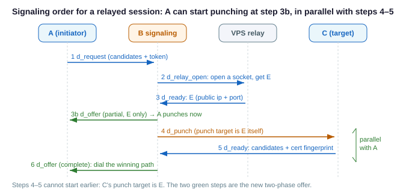
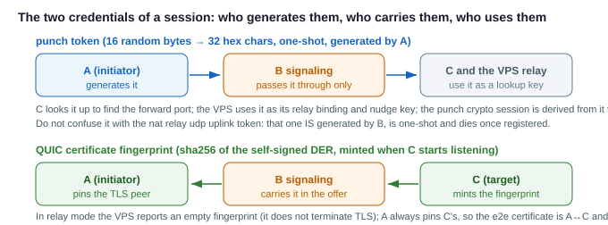
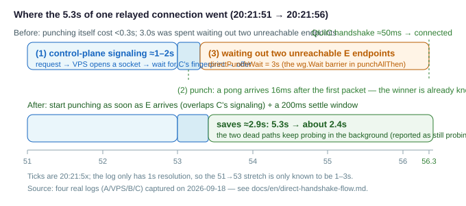
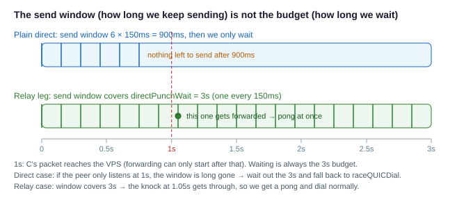

# The full direct / relay handshake, and where its time goes

This document takes one direct connection (or a relayed one, via the VPS blind relay) apart: **who
sends first, who waits for whom, and where the time actually goes**. All five figures are renderings
of the same code; the numbers come from one real run captured on 2026-09-18 (four logs: A/VPS/B/C).

The headline: that connection took **5.3s** from the first log line to being connected, while
punching itself cost under 0.3s — **3.0s went into waiting out two unreachable candidates**. After
changing "wait for every candidate" into "first answer + a settle window", and letting A start
punching early (the two-phase offer), the same scenario connects in about **2.4s**.

## 1. Participants and messages

| Role | What it is | What it does here |
|---|---|---|
| A | initiator (a local entry connection arrived) | mints the token, gathers its candidates, punches, dials QUIC |
| C | target | starts the QUIC listener, reports candidates + cert fingerprint, punches |
| B | websocket signaling server | forwards control messages only; the data plane never touches it |
| VPS | relay node (only when `via` is set) | opens a dedicated UDP socket, reports the relay endpoint E, blind-forwards A↔C QUIC |

Messages (see `nat/direct_msg.go`):

| Method | Direction | Purpose |
|---|---|---|
| `d_request` | A → B | announce candidates + this session's token (+ `via`/`twoPhase`) |
| `d_relay_open` | B → VPS | have the VPS open a relay socket and report endpoint E |
| `d_punch` | B → C / B → VPS | ask C to punch toward E; or register one leg's candidates on the VPS |
| `d_ready` | C/VPS → B | report candidates + cert fingerprint (empty for the VPS) |
| `d_offer` | B → A | hand the endpoints to A; two-phase sends an "E only" half first |
| `d_punching` | A/C → B → VPS | the punch nudge: "I already sent a packet toward you" |

## 2. Signaling order: A can start punching at step 3b

Steps 4–5 (B asks C to punch, C reports its fingerprint) **cannot be moved earlier** — C's punch
target *is* E, so without E it has nothing to aim at. The only compressible part is A's wait: E is
now handed to A first (step 3b), A punches toward E and nudges immediately, in parallel with 4–5.

## 3. The ordering invariant: residents punch first, the VPS follows

Legs A and C each walk these four steps independently. The order is not a race that usually turns
out fine: the nudge is emitted by the `afterFirst` callback of `punchOnlyThen` / `punchAllThen`, and
that callback runs after the UDP `WriteTo` returned — it is code order. On the VPS side there is
**no fallback timer** (a timer that fires early would blast a resident before it punches and poison
its CGNAT mapping); a lost nudge is covered by the resident's 3 sends (0/+600ms/+1.8s), idempotent
per leg.

Forwarding has a much higher bar: the nudge only makes the VPS *willing* to send, while **forwarding**
has hard conditions. `forwardLoop` (`nat/direct_relay.go`) has three gates, and failing any one of
them drops the packet right there (see [direct-relay-design.md](direct-relay-design.md) §5):

1. **The source must be identifiable as a leg**: `classify` matches it against that leg's candidate
   IPs; if B has not registered the leg yet, or the source IP is not among its candidates, drop.
2. **The other leg must be registered**: `to == nil` → drop.
3. **That other leg must have been heard from**: `to.addr == nil` → drop. This is the real readiness
   test: it is **"we received a packet from C"**, not "we managed to send to C" (whether the VPS ever
   sent, and whether it got through, is not checked by the forwarding path — that is what `punchLeg`
   is insurance for).

Two easily-misremembered details:

- `from.addr.Swap(src)` (recording A's real address) comes **after** the `to == nil` check — so before
  C's leg is registered the VPS does not even record A's address. Once C is ready, A must send **one
  more packet**; only that one gets forwarded, and only that one can bring back C's pong. This is
  exactly why a relay leg's send window must cover the whole budget (see §5.1).
- A's QUIC Initial travels the same forwarding path: before both legs are ready, dialing early just
  gets the Initials dropped, leaving QUIC to recover via its own Initial retransmissions (PTO).
  Conversely, during punching any pong A receives can only be C's pong relayed back — so "pong
  arrived" means "forwarding was already ready" (the only exception is the all-failed fallback in
  §6.1).

## 4. Two credentials: the token and the cert fingerprint

- **The token is minted by A** (16 random bytes → 32 hex chars); B only passes it through. It is at
  once C's credential-store key (with the forward port), the punch crypto session key, and the VPS's
  relay binding + nudge key.
- **The cert fingerprint is minted by C** (a self-signed cert generated when the listener starts,
  fingerprint = `sha256(DER)`), carried to A through B for TLS pinning. In relay mode the VPS
  reports an empty fingerprint, so A always pins C's — the e2e certificate belongs to A↔C.

## 5. Where the 5.3s went

| Phase | Before | After | Code |
|---|---|---|---|
| Control-plane signaling (A→B→VPS→B→C→B→A) | 1–2s | 1–2s, but no longer blocking punching | `requestPeer` / `onRelayRequest` / `onRelayReady` |
| Punching (first pong) | 16ms | 16ms | `punchOneThen` |
| Waiting for every candidate | **3.0s** | ≈0.2s | `wg.Wait` in `punchAllThen` → `punchRun` first answer + `directPunchSettle` |
| QUIC handshake + auth | <1s | <1s | `dialQUIC` / `authenticateSession` |
| **Total** | **≈5.3s** | **≈2.4s** | |

Why waiting for everything is so expensive: punching sends 6 packets per candidate (150ms apart)
inside a per-candidate budget of `directPunchWait` (3s). If any single candidate never answers —
common for the relay's E endpoints across ISPs — the barrier has to burn that entire 3s for it,
even when the first path returned a pong a few milliseconds in.

### 5.1 Three time quantities: budget / send window / settle window

Three parameters relate to punching; they look alike and do entirely different things:

| Name | Value | What it governs |
|---|---|---|
| `directPunchWait` | 3s | the **budget**: for one candidate, the upper bound on waiting for a pong before giving up |
| send window `sendSpan` (`punchSendSpan`) | direct `6 × 150ms` = 900ms; relay leg 3s | **whether we keep sending**: one packet per 150ms inside the window, then we only wait |
| `directPunchSettle` | 200ms | the **settle window**: after the first pong, how long we keep collecting other candidates before picking one |

They are independent: the send window only decides "do we still send new packets", never "how long we
wait" (that is always the budget); the settle window only starts counting once a first pong exists.
Any pong stops the sending and returns early — so a healthy direct connection sends 1–2 packets, not 6.

Why a relay leg's window covers the whole 3s: see the last two bullets of §3 (forwarding waits for
both legs, and the side that starts early has no way to know when that happens, so it must keep
knocking).

## 6. The two optimizations that landed

### 6.1 A settle window for path selection

- `punchRun` in `nat/direct_reflect.go`: "punch every candidate" becomes an observable process
  (first-answer signal, all-done signal, a snapshot you can take at any time), with each candidate
  in one of three states: **pending / answered / failed**.
- `pickPeerAddr` in `direct_entry.go`: after the first pong, wait `directPunchSettle` (200ms) for
  other candidates to report, then pick the best among those that concluded and dial. Candidates
  that have not concluded are marked **`still probing`** — they neither win with an RTT of zero nor
  get misreported as unreachable; their probes keep running in the background (they exit on their own
  timeout; no leak).
- The all-failed semantics are unchanged: nothing answered within the budget still returns an error
  and falls back to the parallel `raceQUICDial` race.
- **A relay leg's send window covers the whole `directPunchWait`** (`punchSendSpan`): punching early
  means punching before C has sent its first packet and before the VPS has registered that leg, and
  forwarding requires **both legs to have been heard from** — during that stretch "no pong" only
  means the middlebox is not ready yet, so the side that starts early must keep knocking until the
  budget runs out. Plain direct connections have no such middlebox and still send only
  `directPunchCount` packets.
- The log makes it visible: `path selection for X: ... still probing, ... rtt=16ms <-`.

### 6.2 Two-phase offer: hand A the endpoint E first

- Protocol: `DirectRequest.TwoPhase` (declared by A; an old server ignores it) and
  `DirectOffer.EndpointOnly` (B only sends a partial offer when the peer declared TwoPhase). **An
  old client with a new server, or a new client with an old server, degrades to the single-phase
  flow** instead of failing on the missing fingerprint.
- B (`relayRoleOpen`): as soon as it has E, send the partial offer, then register A's leg and ask C
  to punch.
- A (`requestPeer` / `handshakeFromOffer`): on the partial offer it starts `startPunchAll` right
  away and keeps waiting for the complete offer; once the fingerprint arrives it picks a path (with
  the settle window) and dials. The partial offer is used **only to punch**, never to dial — TLS
  pinning depends on the fingerprint.
- Tests: `TestPunchRunStopsAtFirstAnswer` (returns in 201ms instead of 3s),
  `TestPunchRunPendingIsNotAWinner`, `TestPunchKeepsSendingUntilTheRelayIsReady`,
  `TestRelayTwoPhasePushesEndpointAheadOfFingerprint`, `TestRelayOnePhaseOfferStaysSingle`.

### 6.3 Not done yet (optional)

Writing `direct.relayPublic` as `IP:port` static endpoints (`newStaticRelaySocket`) makes E fully
predictable; then "open the socket" and "ask C to punch" can be issued in parallel, and E could even
be pushed ahead of time so all three sides punch before signaling — one more serial round trip
saved, at the cost of fixing the relay port (one port per concurrent pair).

## 7. Reading the logs

| Line | Meaning |
|---|---|
| `candidates [...] (unavailable: ...)` | this host's candidates; the parenthesised part lists the families that failed (e.g. no IPv6) |
| `requesting X: local socket port ..., my candidates ...` | `d_request` was sent |
| `server sent the endpoint [...] ahead of the peer certificate, punching while its fingerprint is still on the way` | the partial offer arrived; punching starts now |
| `server says X has candidates [...] (fingerprint ...)` | the complete offer (with the fingerprint) arrived |
| `got punch from ... (encrypted=...)` | a punch arrived and a pong was sent back; in relay mode `encrypted=false` is usually the VPS's own `punchLeg` (it holds no e2e session) |
| `relay: resent nudge for token ...` | a nudge resend (by design, 3 in total) — not a punch retry |
| `path selection for X: ... failed / still probing / rtt=...` | selection detail; `failed` = probed, nothing came back, `still probing` = missed the settle window (not proof of unreachability) |
| `punch all failed (...), falling back to a quic dial race` | last-resort fallback: real QUIC dials to **all** candidates in parallel |
| `quic connected to email X at ...` | dial succeeded (auth not included yet) |
| (VPS) `registered leg ... holding punch until its nudge` | the leg is registered, waiting for its nudge |
| (VPS) `leg ... nudged, punching toward it at ...` | nudge received, sending toward that leg |
| (VPS) `leg ... answered after N punch(es), ... stopping` | that leg has been heard, stopping early (N is usually 1) |
| (VPS) **nothing at all** | that packet was dropped silently: the source did not match any leg, or the other leg is not registered / not heard from yet. The forwarding path **logs nothing** for this drop — to confirm it you need a capture (`tcpdump -ni any udp port <relay port>`) |

> For when forwarding actually starts — and why a pong means "forwarding is already ready" — see §3.

## 8. Code and related docs

- A side: [nat/direct_entry.go](../nat/direct_entry.go) — `requestPeer` / `handshakeFromOffer` /
  `ensureSession` / `pickPeerAddr` / `connectPeer`
- Punching and selection: [nat/direct_reflect.go](../nat/direct_reflect.go) — `punchRun` /
  `startPunchAll` / `punchOneThen`; [nat/direct_candidate.go](../nat/direct_candidate.go) —
  `selectCandidate` / `describeResults`
- C side: [nat/direct_accept.go](../nat/direct_accept.go) — `onPunch` / `sendRelayNudge`
- VPS side: [nat/direct_relay.go](../nat/direct_relay.go) — `registerRelayLeg` / `punchLeg` /
  `forwardLoop` / `openRelay`
- B side: [nat/direct_broker.go](../nat/direct_broker.go) — `onRelayRequest` / `onRelayReady`
- Tunables: [nat/direct.go](../nat/direct.go) — `directPunchWait` / `directPunchSettle` /
  `directPunchCount` / `directPunchGap` / `directRelayNudgeGaps`
- Related docs: [direct-relay-design.md](direct-relay-design.md) (relay design and failure
  semantics), [direct-punch-order.md](direct-punch-order.md) (the ordering invariant)
