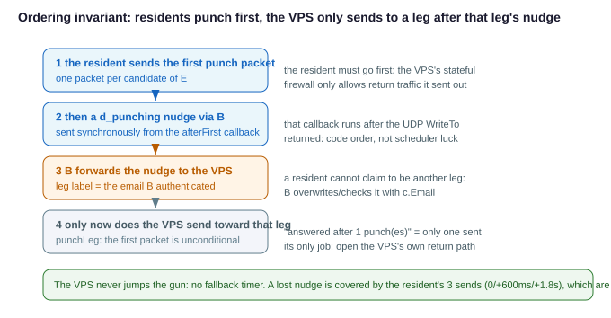

# VPS Blind-Forward Relay (TURN-style direct relay)

> **Status: implemented (phase 2).** The control plane (via/d_relay_open/two-leg registration), data plane (dedicated socket blind forwarding), and authentication (e2e uuid challenge-response bound to fingerprint) are all in place and covered by unit tests / end-to-end tests. Code locations are listed in §11.
> This replaces the earlier idea of "VPS terminates TLS on both legs and bridges in the middle" (see the "Discarded design" at the end of this doc).
>
> One wording discrepancy between the implementation and this doc: C does not rely on A self-reporting its email in the stream. Instead C uses **the initiator email forwarded by B via the hole-punch message (DirectPunch.Email)** — an email already authenticated by B — to look up receive.allow (A cannot forge its identity). The challenge-response only exchanges two frames: nonce and HMAC response.
>
> **Phase 2 change (relative to phase 1)**: the VPS no longer relies on a nudge + `direct.punchFirst`
> **fallback timer** to guess "how long to wait before proactively punching a leg that hasn't nudged
> yet" — that timer, when set too short, would fire before the other leg's signaling round trip
> (especially "C receives the punch, replies d_ready, forwarded to A via B") had actually
> completed, causing the VPS to send a packet to a leg before that leg had punched for real —
> exactly the "public side punches first and poisons the resident's CGNAT mapping" mistake. The
> **fallback timer is gone entirely**: the VPS only sends to a leg **after receiving that leg's
> nudge** (forwarded by B, carrying the leg label B authenticated). The nudge is a deterministic
> "this leg has already punched" signal over the authenticated control plane — no timing guess.
> `direct.punchFirst` is still irrelevant for relay legs. See §3, §6.
>
> **Why the VPS must still send on its own**: the VPS machine itself may also sit behind a
> stateful firewall / security group / egress gateway (common with cloud providers) that only
> allows return traffic from an address **after this host has sent to that address first**. If the
> VPS never sends proactively, the residents' holes simply don't exist as far as the VPS is
> concerned — their packets never get in, and "hearing from a leg" never happens. The first cut of
> phase 2 turned "never get ahead" into "never initiate", relying on "hearing first, then
> replying" (`primeLeg`) — that broke a working route in practice. So the **primary** path is the
> **nudge-driven proactive send** (`punchLeg`); `primeLeg` (a few packets back once a leg is
> actually heard) is only a supplement.

## 1. Goal

A public VPS acts as a **relay with minimal configuration** between A and C: the VPS **does not configure `forward`/`direct`/`receive.allow` per A-C pair** — it only needs a single "allow relay" master switch; the target C is **specified by A in the request**.

Use case: A and C are both behind restrictive CGNAT and cannot reach each other directly (see [direct-punch-order.md](direct-punch-order.md)), but each can establish a connection to a public VPS. Data is relayed through the VPS and **does not pass through** the signaling server B (whose network is poor).

This covers **TCP + UDP** in one shot (RDP's TCP main channel + UDP graphics channel). File transfer (`-send`/`-recv`) is **out of scope for this design** — that path already has `-via relay` (via B) available.

## 2. Core model: VPS only does blind forwarding; QUIC is end-to-end between A↔C

Key choice: **the QUIC/TLS connection is end-to-end A↔C** (A is the client, C is the server presenting C's self-signed certificate, and A pins it by fingerprint); **the VPS only forwards opaque UDP packets at the transport layer**, terminating no TLS and decoding no QUIC.

```
   A ─────(end-to-end QUIC-TLS, VPS cannot see plaintext)───── C
   │                                             │
   │  UDP packet                           UDP packet  │
   └───────────▶  VPS dedicated relay socket  ◀──────────┘
              (blind-forwards between A↔C by source address)
   Data does not pass through B; B only exchanges addresses/fingerprint/token during setup
```

**This model incidentally eliminates the TCP+UDP difficulty**: the VPS forwards the **opaque packets** of the A↔C QUIC connection; TCP rides its stream and UDP rides its datagram, all handled inside that single end-to-end QUIC between A and C — **exactly the same as the current direct connection**. The VPS distinguishes no protocol, does no stream/datagram bridging, and does no sessionID mapping. So "TCP+UDP together" holds naturally.

## 3. Control plane: signaling flow

> The six-step sequence diagram, the two-phase offer (E is handed to A first so its punching
> overlaps C's signaling), and a breakdown of one real connection, see
> [direct-handshake-flow.md](direct-handshake-flow.md).

**A's configuration** (add `via` to `client.direct.rules[]`):

```yaml
# A (resident, CGNAT)
websocket:
  client:
    direct:
      punchFirst: true                # only matters for direct (non-via) ordering, see direct-punch-order.md;
                                       # relay legs ignore this — both legs are residents and punch first, and the VPS
                                       # only sends after that leg's nudge, so there's no ordering problem (see §6)
      rules:
        - listen: "both://:13389"     # mstsc connects here
          forward:
            email: home@example.com  # final target C
            tag: rdp                 # which rule in C's forward[] to use (matched by tag)
          via: relay@example.com  # relay through this VPS; empty = direct to C (current behavior)
```

**Signaling reuse principle (important)**: a relay is essentially **two ordinary "resident→cloud" hole-punch legs (A↔VPS, C↔VPS), both punched toward the VPS's same relay endpoint E**, plus B coordinating in the middle. So **the existing direct-connection signaling is reused almost verbatim** — we only change "the target to punch/dial" from "the peer" to "the VPS's relay endpoint E". **Only one new message type `d_relay_open` is needed** (B→VPS).

| Existing signaling | How it's used in relay | Change |
|---|---|---|
| `d_request` (A→B) | A adds `via=VPS`; when B sees `via` non-empty it enters relay mode | `DirectRequest` adds `Via string` |
| `d_relay_open` (B→VPS) | **the only new message**: tells the VPS to open a dedicated socket, ask the reflector for its public endpoint E, and prepare to be hole-punched by A/C | new `DirectRelayOpen` |
| `d_ready` (VPS→B) | VPS uses it to report back the relay endpoint E (filled into `Candidates`) | reused, no change |
| `d_punch` (B→VPS) ×2 | B forwards A's and C's candidates to the VPS **in two separate messages**: the VPS uses them both to **recognize** which leg an incoming packet's source IP belongs to and as the destination to send to once that leg's nudge arrives | reuses its `PeerAddrs` shape |
| `d_offer` (B→A) | fills "the endpoint A should dial" as **E** and gives A **C's certificate fingerprint** | reused, no change |
| `d_punch` (B→C) | makes C punch to **E** (`PeerAddrs` filled with E) instead of toward A | reused, no change |
| `d_punching` (nudge) | **each relay leg sends one**: after punching E the resident nudges the VPS via B (B keeps the sender's email as the leg label); the VPS only sends to that leg after this arrives | reused, different routing (see below) |

> **Why the VPS still needs B to forward A/C's candidates**: the VPS's relay socket only relays between two candidate IPs and drops everything else (injection prevention) — and when it has to **send proactively**, those candidates are the only address it has (it hasn't heard from that leg yet, so there is no learned address). So the candidates serve two purposes: recognizing "is this source A or C", and the send target once the nudge arrives. See §6.

**Flow** (setup phase, signaling via B; data not via B):

1. `d_request` (A → B, **with `via`**): A wants to relay via `via` (VPS) to C (`email`)'s `forward.tag`, attaching A's own candidates and the current `token`. B sees `via` non-empty → enters relay mode.
2. `d_relay_open` (B → VPS): tells the VPS to **create a new dedicated UDP socket** for this `token`, ask the reflector to discover its public relay endpoint **E**, and prepare to accept hole-punches from A and C. The VPS reports E back to B with `d_ready`.
3. B uses two `d_punch` messages to forward candidates to the VPS separately: one with A's candidate, one with C's candidate (first send a normal `d_punch` to C to obtain C's candidate and fingerprint). The VPS only **registers** them: each registered leg parks and waits for that leg's `d_punching` nudge (see below). There is **no** "wait a while, then punch anyway" fallback timer (see §6).
4. `d_offer` (B → A): fills the endpoint to dial as **E** and attaches **C's certificate fingerprint**. Simultaneously sends `d_punch` to C, with its `PeerAddrs` filled as **E**, making C punch to E (instead of toward A).
5. **A and C each actively punch to E** (both are "resident→cloud", each doing the `punchOnly` it would do anyway), and after their first packet **each sends a `d_punching` nudge to the VPS** (via B, which keeps the sender's email as the leg label).
   - On a leg's nudge, the VPS **proactively sends a few packets toward that leg's candidates**, opening the return path on its own stateful firewall (this step is the crux, see §6);
   - only then can that leg's later packets get in, and the VPS **learns** its real address from the source; **once both legs have been heard from**, it starts forwarding received packets to the other side (including the hole-punch probes themselves).
   - Ordering needs no coordination: whichever leg's packet arrives first gets silently dropped (because the other side hasn't been learned yet), but that leg is now learned by the VPS; once the other leg also sends something, subsequent packets from either leg forward normally.
   - **Both legs must succeed for the relay to succeed**; if either leg cannot reach the VPS, the entire relay fails (see failure semantics).
6. Once both sides are through, **A initiates the QUIC dial**: destination address filled as E (the relay endpoint), TLS expects C's fingerprint. The VPS forwards the packet to C, C's listener receives it (source is the VPS relay port) and accepts, and the QUIC handshake completes **end-to-end on A↔C**.
7. A sends its own `email` (a label) over this e2e QUIC stream and does one **uuid challenge-response** with C (see authentication; the uuid never goes online); C verifies and then lets it through. After that, the TCP stream / UDP datagrams both run inside this e2e QUIC, and the VPS blindly forwards throughout.

**VPS configuration** (removes per-pair forward/direct):

```yaml
# VPS (public)
websocket:
  client:
    direct:
      accept: true       # still required: so residents can punch-connect up
      relay: true         # new: allow acting as relay; by default open to all authenticated subscribers in B
      # relayEmail:       # optional: restrict which source emails may use this machine's relay (empty = fully open, needs B on the same version)
```

**C's configuration** (essentially unchanged; the `forward` whitelist is still the gate):

```yaml
# C (resident, CGNAT)
websocket:
  client:
    direct:
      # punchFirst is not needed for the relay leg (both legs are residents and punch first; the
      # VPS only sends after that leg's nudge, see §6); if C
      # also happens to be a direct-connect initiator behind CGNAT elsewhere, decide that
      # separately per direct-punch-order.md
      accept: true
    forward:
      - tag: rdp
        target: 192.168.1.10:3389
    receive:                         # C keeps a "which A's are allowed" list (see authentication)
      allow:
        - email: office@example.com
          uuid: <A's uuid>
```

## 4. Authentication: the gate is at C; the VPS is blind throughout

- **A confirms the peer is the real C (certificate fingerprint, not uuid)**: the A↔C **e2e QUIC-TLS** uses C's self-signed certificate, and A **pins** it using the fingerprint distributed by B. Even if packets come relayed from the VPS, A can confirm the peer is C by the certificate — **independent of address** — and the VPS, lacking C's private key, cannot impersonate C. Data is also encrypted by this TLS; the VPS has no key and sees only ciphertext.
- **C confirms the peer is the real A (uuid challenge-response, one-way, uuid never goes online)**: within the entire relay the uuid is used **only for the single direction "C verifies A"** ("A verifies C" is already handled by the certificate fingerprint above). A and C both have A's uuid locally (A has its own; C's `receive.allow` has A's — **reusing the existing `receive.allow`, no new list opened**), so there is no need to send the uuid over; just prove "I know the uuid" with a challenge-response:
  1. A sends its own `email` over the e2e QUIC stream (**a label, not a secret** — sending it is harmless);
  2. C looks up the expected uuid by email in `receive.allow` and sends a random `nonce`;
  3. A replies with `HMAC(uuid, nonce || C's certificate fingerprint)`, and C verifies it with the looked-up uuid. A fresh nonce each time prevents replay; **binding C's certificate fingerprint into the HMAC is to prevent relay-layer replay** — the VPS is an untrusted middleman; without the fingerprint binding, a recorded challenge-response could theoretically be replayed by the VPS onto "another connection where it impersonates". Once C's fingerprint is bound, the response is valid only for "the peer that truly holds that certificate's private key" on this e2e TLS; if the VPS switches connections it won't match.
  - This is consistent with the existing `-via relay` approach (uuid treated as keying material, identity proven by "using it correctly", **never sent in the clear**).
  - Comparison: the existing **direct** file transfer puts the uuid verbatim into the e2e stream for byte-by-byte comparison (sent in the clear inside TLS) — acceptable for direct (the peer is C), but in a relay the VPS is an untrusted middleman, so the challenge-response is preferable and the uuid is kept out of even the TLS: even if C's certificate private key leaks, the uuid does not leak with it.
- **No separate broker token needed**: C's relay listening port is only reachable when "the binding is built via B + A's packet comes relayed through the VPS" (a random scan cannot reach it), plus C's `forward` whitelist gates the ports, which already blocks unauthorized connections; the uuid challenge-response alone carries identity authentication. Keeping a token as a cheap "reject illegal connections earlier" door is also fine — but note **a token is a one-time capability value, designed to be transmitted** (B distributes it); sending it leaks no long-term secret, unlike the uuid.
- **Injection prevention**: the VPS's dedicated socket **only relays between "A's address ↔ C's address"**; packets from any other source address are dropped; the binding assignment must go through B (B has authenticated the initiator).

**Only non-long-term secrets are transmitted across the network**: `email` (label), `nonce` (random), C's one-time certificate fingerprint (via B). **The long-term secret uuid never goes online**; data is encrypted by e2e QUIC-TLS.

**Key conclusion: security does NOT depend on `direct.encrypt`.** Authentication (uuid challenge-response) and data are both inside/on top of the A↔C e2e QUIC-TLS, unrelated to hole-punch packet encryption. `direct.encrypt` **degenerates to purely optional**: it only encrypts the "resident↔VPS" two legs' hole-punch packets, masking plaintext features to prevent operator DPI packet drops (a "can it connect" reliability issue, not a "will it leak" issue). With it off, no secret leaks either — the plaintext hole-punch packet only contains `verb+nonce` anyway.

**The VPS does not need to know or derive this hole-punch encryption key at all.** The bytes the VPS relays between A and C are forwarded blindly (see §5): if A and C each encrypted their own hole-punch packets per `direct.encrypt`, the VPS forwards them unchanged, so the content is already encrypted — there is no need for the VPS to implement `deriveDirectSessionKeys` or take part in any key exchange.

The few packets the VPS itself proactively sends (see `punchLeg`/`primeLeg` in §6), however, **remain plaintext**: they are just placeholder packets to open whatever NAT/stateful firewall the VPS machine itself might sit behind, and carry no data — `direct.encrypt` doesn't cover them, and there's no need for it to. What they leak is only `verb+nonce`, the same thing an unencrypted hole-punch packet always leaks when `direct.encrypt` is off — no extra exposure. The actual user data traveling over the A↔C hole-punch/QUIC path is still encrypted whenever it's supposed to be; the VPS's own priming packets don't change that.

> Difference from the earlier step 2: authentication is **not** placed on "uuid-encrypted hole-punch packets" (that would make authentication depend on direct.encrypt, and amount to using the uuid to directly encrypt/decrypt the hole-punch packets), but instead on the **in-stream challenge-response after the e2e QUIC is built**. In this model the hole-punch packet is only responsible for opening the hole.

## 5. Data plane: dedicated UDP socket blind forwarding

- The VPS uses **one dedicated UDP socket per A↔C pair** (not via quic-go, pure `ReadFrom/WriteTo`).
- Binding: the two source addresses A and C appear on the socket one after another; once recorded, it relays "A→C, C→A"; only these two addresses are recognized.
- **Only forwards to a side whose real address has already been learned — never falls back to
  a candidate address as a guess.** A candidate is an unverified address reported during
  signaling, used to recognize "which leg does this source belong to" and as the send target once
  that leg nudges — it is not a forwarding destination: the VPS should not hand a leg someone
  else's bytes before it has heard from that leg (see §6). Before both legs have been learned,
  any received packet is simply dropped.
- **The VPS does send proactively, but only after that leg has already spoken**, at two moments:
  on that leg's nudge, toward its candidates (`punchLeg`, the primary path, which opens the
  return path on the VPS's own firewall and **stops as soon as that leg answers**); and the first
  time it actually hears a leg, only if the learned address is not among its candidates (the port
  drifted), a few packets back at that real address (`primeLeg`, a supplement). See §6.
- **No distinction between TCP/UDP**: what is forwarded is opaque bytes; A↔C's QUIC itself distinguishes stream/datagram.
- **Simple lifecycle**: idle for **30 minutes with no data** closes this socket + its forwarding goroutine (reusing `directUDPIdle`). Because the A↔C QUIC has a 20s keepalive, while the connection is alive the socket sees packets every 20s and is never misjudged idle; only when the QUIC truly dies is it reclaimed after 30 minutes. Living ones stay, dead ones self-clean — no complex reclamation logic needed.
- **Extra benefit of the dedicated socket**: natural isolation — closing one relay pair does not affect other pairs; the address binding also naturally prevents hijacking.

## 6. Ordering: never get ahead — but the VPS must send when the nudge says so



A relay has two legs, both "resident→cloud". Three constraints must hold at once, or nothing
works:

1. **The resident must send first**: A and C are both behind NAT/CGNAT; neither mapping is
   something the VPS can guess — each has to punch toward E itself.
2. **The VPS must never get ahead of a resident**: the public side punching first poisons the
   resident's CGNAT mapping (see [direct-punch-order.md](direct-punch-order.md)) — the earliest
   trap we fell into.
3. **The VPS must still send once on its own**: the VPS machine itself often sits behind a
   stateful firewall / security group / egress gateway that only lets return traffic through
   **after this host has sent to that address first**. Without that send, the residents' holes
   don't exist as far as the VPS is concerned — their packets never get in and "hearing from a
   leg" never happens. Phase 2's first cut missed exactly this and broke a route that worked.

**How 2 and 3 are both satisfied**: move the confirmation of "the resident has already sent" from
the **data plane** to the **control plane**. After its first packet, a resident sends a
`d_punching` nudge to the VPS via B (over the authenticated websocket, carrying the leg label B
authenticated), and the VPS **only then** sends a few packets toward that leg's candidates
(`punchLeg` in `nat/direct_relay.go`).

"The nudge goes out only after the first packet" is a **hard guarantee**, not a timing
coincidence: the nudge is hung off the punch function's callback (`punchOnlyThen` /
`punchAllThen` in `nat/direct_reflect.go`), which fires after `WriteTo` returns successfully —
the same mechanism on the A side (`pickPeerAddr`) and the C side (`punchOnlyThen`). If no packet
ever goes out (no usable candidate), the callback never fires, so the nudge can't falsely claim
"I already punched".

`nudgedEarly`: C's nudge often beats B's registration (C nudges the moment it punches, while B
only registers C's leg after C's `d_ready`). A nudge that arrives early is recorded on the
binding and replayed at registration time, so it is never lost.

**Fallback timer**: none. Phase 1 had one ("if no nudge within `directPunchFirstDelay`, punch
anyway") and it misfired whenever another leg's signaling was slower than expected (the VPS
registers leg A long before A even receives the offer) — sending before the resident had punched,
i.e. straight into constraint 2. The nudge rides an authenticated control plane; if it never
arrives, that leg didn't punch or the control plane is broken, and blindly punching an
unverified candidate would only make things worse. Better not to send.

**The nudge is sent 3 times** (0 / +600ms / +1.8s, see `directRelayNudgeGaps`): with no fallback
timer, a lost nudge means that leg never gets a second chance and the whole relay is dead — the
cost of losing one small control-plane packet dwarfs the cost of sending two extra. Duplicates are
harmless: the VPS is idempotent per leg (`fireRelayLeg` closes the `fire` channel exactly once),
so extra nudges are ignored rather than triggering another punching round.

**`punchLeg` stops as soon as the leg answers**: the **only** reason to send these packets to a
leg is "make the VPS machine's own firewall let that leg's packets in". The first one always goes
out (that is the core of the whole mechanism); from the second onward, each send first checks
whether that leg has already been **heard from**, and stops immediately if so — the goal is met,
and the remaining packets are pure noise: the pongs they earn get blind-forwarded to the other
side and dropped there for an unknown nonce, all of it crammed into the first second of the QUIC
handshake.

**`primeLeg` (supplement, and only when needed)**: the first time a leg is heard, if the learned
real address is **not** among its candidates (the port drifted), the VPS sends a few packets at
that real address — `punchLeg` aims at the candidates, so a drifted port means it opened a hole
toward a port nobody is listening on; this one is the accurate shot. Conversely, when the real
address *is* one of the candidates (the normal case) it is **skipped**: the VPS has already sent
proactively to that exact address, and repeating it would just resend the same packets. This
doesn't violate constraint 2 (that leg has just proven it spoke first, so the VPS is still
second), but it cannot be the primary path — because of constraint 3, *not* hearing a leg is the
normal case.

Invariants (VPS side):

1. Register a leg → **park**; send nothing (wait for its nudge).
2. That leg's nudge arrives → send a few packets toward its candidates (`punchLeg`), **stopping as
   soon as that leg answers**.
3. A leg is heard (real address learned) → if it's the first time *and* the real address is not
   among its candidates, send a few packets back at the real address (`primeLeg`).
4. **Only once both legs have been heard from** does it forward received packets to the other
   side — it makes no distinction between a hole-punch probe and real QUIC data; both are
   treated the same.

`direct.punchFirst` has no effect at all on relay legs; it only applies, with its usual
semantics from [direct-punch-order.md](direct-punch-order.md), to plain direct connections
(not going through `via`).

## 7. Failure semantics

Both legs (A↔VPS, C↔VPS) must **both** succeed for success; if either leg fails, the entire relay fails and, per the consistent direct-connection convention, **fails outright with no fallback** (the relay itself is the substitute when hole-punching fails, and it has no next level). The failure reason is reported back to A via `METHOD_CLOSE` as much as possible, to help distinguish "which VPS leg cannot connect" from "C's forward/uuid rejection".

### Known limitation: symmetric NAT (candidate port ≠ real port)

When the VPS punches a leg after its nudge, the only address it holds is the **candidate** B
forwarded — it hasn't heard that leg yet, so there is no learned address. Under cone NAT/EIM the
two are identical and everything works; under **symmetric NAT/CGNAT** the resident uses a
**different source port** toward the reflector than toward E, and then:

- The packets the VPS sends to the candidate port land on a state nobody is listening on, and are
  dropped;
- The packets the resident actually sends come from a port that doesn't match its candidate, so
  they'd first have to be *heard* by the VPS to be let through — and being heard depends on the
  previous point.

The two sides wait for each other and **the relay does not work on such networks**. This is an
inherent boundary of hole punching, not something the relay introduces: plain direct connections
(not via `via`) fail under symmetric NAT just the same.

How to recognize it: the resident's `my candidates` and the address in the VPS's
`punching toward it at ...` share the same IP but a **different port**; or the VPS prints
`leg ... nudged, punching toward it` and then never `learned` that leg, while the resident just
times out.

No automatic fallback: covering symmetric NAT requires either port prediction (spray guesses at
the next port — success scales with how aggressively you guess, and it makes noise for the peer)
or having the VPS terminate QUIC as a real relay (which gives up end-to-end encryption). Neither
is in scope. **Treat it as known-unsupported**: when symmetric NAT must be traversed, use a
forwarding path that doesn't rely on hole punching.

## 8. Phasing

Because the VPS is opaque forwarding and makes no TCP/UDP distinction, the data plane is **done in one pass** (dedicated socket blind forwarding). The work is mainly in the **control plane** (new signaling + two-leg punch coordination + QUIC through relay). Recommendation:

- **Phase 1**: the entire control plane + dedicated socket blind forwarding + authentication (uuid challenge-response, e2e). Get A→VPS→C RDP (TCP+UDP together) working, with no per-pair config on the VPS.
- No need to phase for TCP/UDP.

## 9. Decisions already made

- **Authentication direction**: one-way — **C verifies A with uuid challenge-response**; A verifies C with **certificate fingerprint** (not uuid). Both ends are authenticated, and the VPS cannot impersonate either.
- **C-side list**: **reuse the existing `receive.allow`** (email+uuid), do not open a separate C-side list for relaying (change its comment from "file-transfer only" to "file transfer + relay authentication"). This is distinct from the VPS-side `relayEmail` below: the former governs "who may reach C", the latter "who may consume this VPS's relay resources".
- **`direct.relay` default**: once enabled, open to "all authenticated subscribers within B"; `direct.relayEmail` optionally tightens it to specific source emails. The initiator's email is stamped by B from its own authenticated connection and delivered via `DirectRelayOpen.Email` (not self-reported by A); the VPS checks the list **before** opening the relay socket. If the list is configured but the email arrives empty (an old B that does not send the field), the VPS refuses the relay — an allowlist must not silently lapse just because the peer is on an older version.
- **Relay target granularity**: one target C per A↔VPS connection.
- **Naming**: A side `via`, VPS side `direct.relay`.
- **No separate broker token needed**: uuid challenge-response alone carries it (see §4); optionally kept as a cheap early-reject door.
- **VPS endpoint vs C address**: A dials the **VPS's relay endpoint (`VPS_ip:dedicated_port`)**; both A and C punch to this same endpoint, and the VPS distinguishes by source address; A **never uses C's real ip:port** (unreachable and unnecessary — "whether the peer is C" is guaranteed by the certificate fingerprint, independent of address).
- **How the VPS relay endpoint's public address is obtained**: the address the VPS's dedicated socket binds locally ≠ the address seen from outside (e.g. Tencent Cloud local `10.x`, public `49.x`), so the VPS cannot directly report its local address. **Reuse the existing reflector discovery** — the VPS lets this socket also ask the reflector once ("what `ip:port` do I look like to you"), and reports the discovered public address to A and C via B (the same `gatherCandidates` used by resident machines, and by the VPS doing ordinary direct connections today to learn its own public endpoint). This way, whether the VPS is pure public, 1:1 NAT (port preserved), or NAT with changing ports, the correct endpoint is obtained.
  - **Exception: a symmetric NAT gateway with per-flow randomized egress.** The public endpoint E_ref the reflector discovers is the mapping of the `VPS->reflector` flow; if the VPS sits behind a symmetric NAT gateway (different external IP:port to the reflector, to A, and to C), the packet A sends to E_ref never reaches the VPS's inbound mapping, and the relay is dead (same reason hole-punching fails against symmetric NAT). In that case the reflector-discovery path itself fails and needs a **static inbound** fallback (see below).
- **Static public endpoint (`direct.relayPublic`)**: when configured it **skips the reflector** and uses the configured endpoint directly as E, and binds the relay socket **to the fixed port in the endpoint**. Used for the symmetric NAT gateway scenario above: configure a fixed DNAT inbound rule (public `IP:port` -> VPS same UDP port), so the inbound is permanently open regardless of whether egress is randomized. Since a fixed port allows only one socket, **configuring N different ports allows at most N concurrent relay pairs** (pick a free port to bind when opening; if all are occupied this attempt fails). DNAT port preservation is assumed; it also applies when there is a direct public IP with no NAT (just allow the port). The simplest is still giving the VPS a real 1:1 public IP, in which case the default reflector discovery suffices.
- **Multiple public IPs with random ports (bare-IP form of `direct.relayPublic`)**: when public IPs are assigned directly to the VPS but routing selects different source IPs for different destinations, one reflector discovers only one egress. List IPs without ports; every binding keeps a separate random port and advertises that port on all configured IPs. Each leg can therefore punch the endpoint matching the VPS's return source without consuming fixed port slots. Bare IPs cannot be mixed with `IP:port` entries.
- **Maximize reuse of existing direct-connection signaling** (see §3 table): a relay = two "resident→cloud" hole-punch legs (both punched toward the VPS relay endpoint E) + B coordinating. Reuse `d_request` (add `Via` field) / `d_ready` / `d_punch` / `d_offer`, **adding only `d_relay_open` (B→VPS) as one message** to make the VPS open a dedicated socket and discover E. B uses two `d_punch` messages to forward A's and C's candidates to the VPS, so the VPS can recognize which leg an incoming source IP belongs to and has an address to send to once that leg's `d_punching` nudge arrives (see §3, §6).
- **uuid challenge-response bound to certificate fingerprint to prevent relay-layer replay**: `HMAC(uuid, nonce || C's certificate fingerprint)`. The VPS is an untrusted middleman; once the fingerprint is bound, the response is valid only for "the peer that truly holds that certificate's private key", and the VPS cannot replay it onto another connection. A fresh nonce each time prevents ordinary replay. The derivation approach in [nat/direct_crypto.go](../nat/direct_crypto.go) can be reused.

## 10. Open (decide at implementation time)

- (Signaling and authentication construction were finalized in §3, §4, §9; there are no open items here for now — supplement with details encountered during implementation if any.)

## 11. Related code (implementation locations)

- Signaling: [nat/direct_msg.go](../nat/direct_msg.go), [nat/direct_broker.go](../nat/direct_broker.go) (B-side new relay coordination), [nat/direct.go](../nat/direct.go) (client-side signaling dispatch).
- A-side initiation: [nat/direct_entry.go](../nat/direct_entry.go) (`via` non-empty → relay setup + e2e dial).
- Command line: `-send`/`-recv`'s `-via`, besides the two reserved keywords `direct`/`relay`, filling in a VPS's email is equivalent to assigning `conf.ClientDirect.Via` for this one-shot transfer (see `resolveVia`), no need to write it into the config file, see [nat/file_send.go](../nat/file_send.go), [nat/file_recv.go](../nat/file_recv.go).
- VPS-side relay: new code (dedicated UDP socket blind forwarding + binding + idle reclamation); `direct.relay` switch.
- C-side accept: [nat/direct_accept.go](../nat/direct_accept.go) (punch to relay endpoint + send nudge + listen accept + uuid challenge-response verification).
- Ordering: the VPS only sends to a leg after that leg's nudge (no fallback timer, see §6), so
  `direct.punchFirst` is not involved; that
  switch only applies to plain direct connections per [direct-punch-order.md](direct-punch-order.md).
- Config: [utils/conf/router.go](../utils/conf/router.go) (`ClientDirect.Via`, `DirectSettings.Relay`, optional `DirectSettings.RelayEmail`, `DirectSettings.RelayPublic`, all under `WsClient.Direct`).

## Appendix: Discarded design (VPS two-leg bridge)

Early idea: the VPS terminates the two QUIC-TLS connections `A↔VPS` and `VPS↔C` separately and bridges stream/datagram in the middle. Drawbacks: the VPS can see plaintext, needs sessionID mapping and bidirectional bridging for UDP (complex), and C can only authenticate the VPS, not A. The blind-forwarding model of this design is comprehensively superior (VPS blind, TCP/UDP unified, C authenticates A directly), so the two-leg bridge is discarded.
